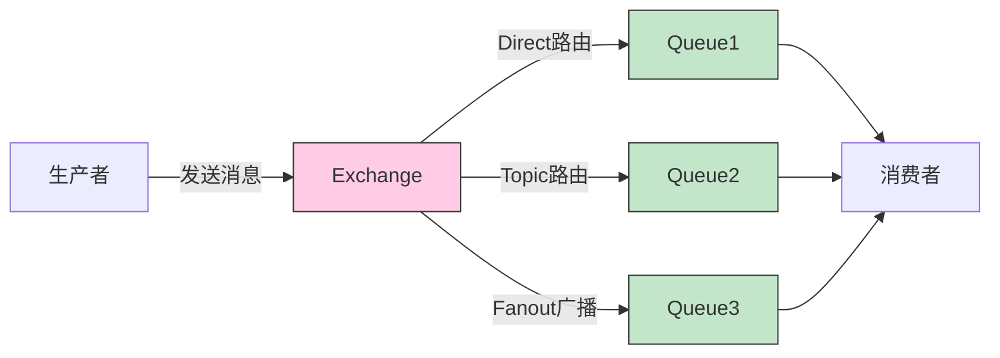
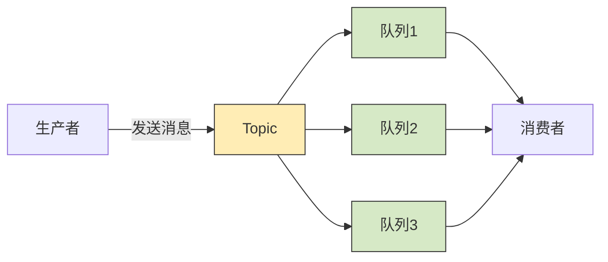
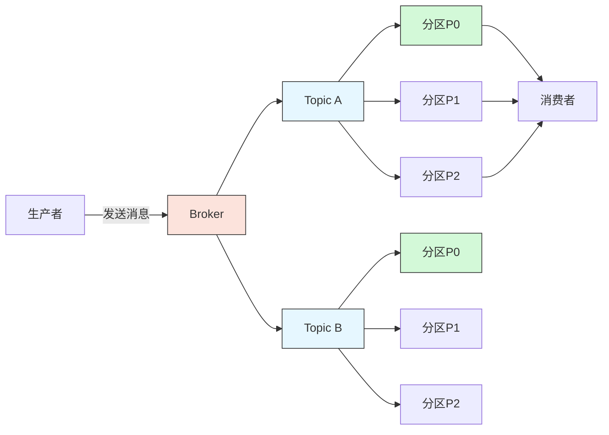

### RabbitMQ、RocketMQ、Kafka 消息模型详解

以下是 RabbitMQ、RocketMQ 和 Kafka 的消息模型的详细说明以及对应的示意图。

---

#### 1. **RabbitMQ 消息模型**
RabbitMQ 使用基于 `Exchange` 的路由机制，将消息从生产者发送到消费者。支持以下几种交换机类型：
- **Direct**：基于路由键精准匹配队列。
- **Topic**：基于路由键的模式匹配发送消息。
- **Fanout**：将消息广播到所有绑定的队列。

---

#### 2. **RocketMQ 消息模型**
RocketMQ 基于 `Topic` 的模型，生产者将消息发送到主题（Topic），然后消费者从队列中读取消息。
- **Producer**：负责生产消息并发送到指定的 Topic。
- **Topic**：存储和管理消息的逻辑分组。
- **Consumer**：通过订阅队列获取消息。

---

#### 3. **Kafka 消息模型**
Kafka 使用分区的概念对 Topic 进行管理，每个 Topic 由多个分区（Partition）组成。生产者可以将消息写入指定的分区，消费者从分区中读取消息。
- **Topic**：消息分类的逻辑单元。
- **Partition**：实现消息并行处理，提高吞吐量。
- **Broker**：管理和存储消息的服务器。
- **Consumer**：通过订阅 Topic 的分区获取消息。

---

### 总结对比

| 特性            | **RabbitMQ**                             | **RocketMQ**               | **Kafka**                 |
|-----------------|------------------------------------------|----------------------------|---------------------------|
| **模型**        | 基于 `Exchange` 的路由                  | 基于 `Topic` 的队列        | 基于 `Topic` 和分区的消息 |
| **应用场景**    | 实时性高的消息传递                      | 延时消息、分布式事务        | 大规模日志、流式数据处理 |
| **优点**        | 灵活的路由策略，多协议支持               | 延时、顺序消息处理出色      | 高吞吐量、分区并行处理    |
| **缺点**        | 难以扩展至大规模                        | 学习成本较高               | 不支持灵活的路由策略      |

RabbitMQ、RocketMQ 和 Kafka 在不同的场景中各有优势，选择适合的消息队列中间件需要根据系统的需求、性能要求和开发维护成本来决定。
