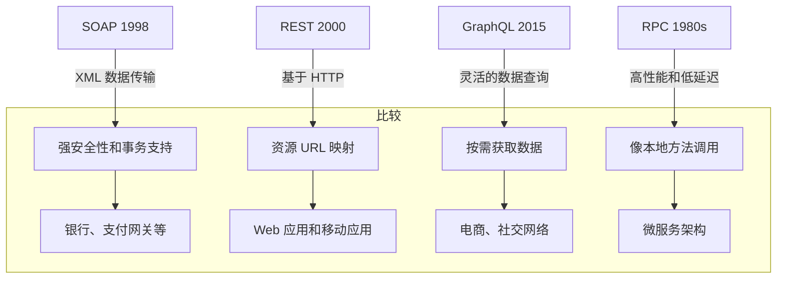
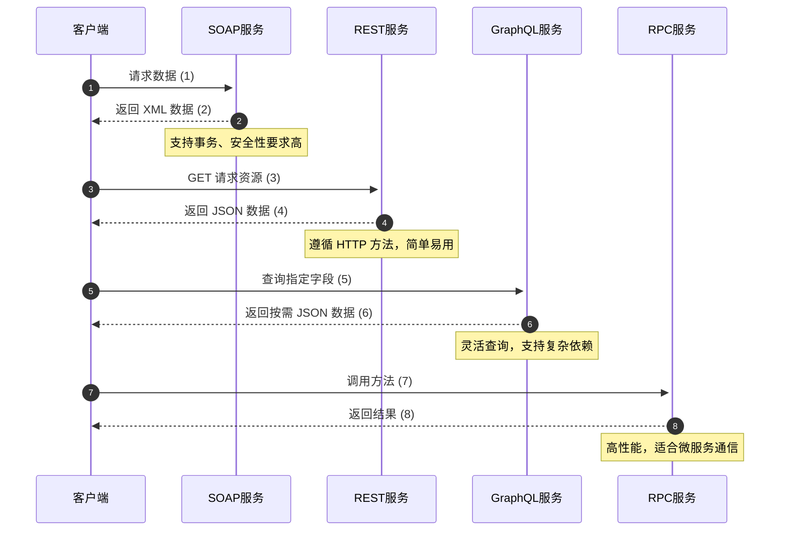

### SOAP vs REST vs GraphQL vs RPC

以下是关于 API 时间线及不同 API 架构风格比较的说明：

随着时间的推移，不同的 API 架构风格被开发出来，每种风格都有自己的数据交换标准化模式。以下是它们的主要特点和适用场景：

---

#### **1. SOAP (Simple Object Access Protocol)**
- **时间点**：1998年
- **特点**：
  - 基于 XML 的协议，用于数据交换。
  - 提供了严格的消息格式和安全规范（如 WS-Security）。
  - 支持事务处理和 ACID。
- **适用场景**：
  - 企业级应用，需要强一致性和复杂操作。
  - 银行、支付网关等对安全性要求高的服务。
- **缺点**：
  - 比较笨重，解析和传输速度慢。

---

#### **2. REST (Representational State Transfer)**
- **时间点**：2000年
- **特点**：
  - 基于 HTTP 协议，使用简单的 URL 访问资源。
  - 使用多种格式（如 JSON、XML）交换数据，JSON 更常用。
  - 无状态性，每个请求都是独立的。
- **适用场景**：
  - Web 应用程序。
  - 移动应用，尤其是需要快速开发的系统。
- **缺点**：
  - 在复杂数据查询时，可能需要多次请求。

---

#### **3. GraphQL**
- **时间点**：2015年
- **特点**：
  - 由 Facebook 开发，用于更灵活的数据查询。
  - 客户端可以指定需要的字段，避免过多或过少的数据传输。
  - 单一端点，支持复杂的数据依赖关系。
- **适用场景**：
  - 前端开发，尤其是数据需求多变的场景。
  - 高交互性应用，比如社交网络或电商平台。
- **缺点**：
  - 更复杂的学习曲线。
  - 需要额外处理性能优化和缓存。

---

#### **4. RPC (Remote Procedure Call)**
- **时间点**：远早于 SOAP，可追溯到 1980 年代。
- **特点**：
  - 调用远程服务的方法像本地方法一样简单。
  - 支持多种协议和数据格式（如 gRPC 使用 ProtoBuf）。
  - 性能较高，尤其适用于微服务间通信。
- **适用场景**：
  - 微服务架构。
  - 需要高性能和低延迟的内部服务通信。
- **缺点**：
  - 更低的可读性，不如 REST 友好。

---

### **API 风格对比图示例：**

---

### **总结**
1. **SOAP** 提供了强安全性，适合企业级场景，但比较笨重。
2. **REST** 是最通用的架构风格，适用于大多数 Web 和移动开发。
3. **GraphQL** 提供灵活性，适合复杂的前端开发场景。
4. **RPC** 提供了高性能，适合微服务和内部通信。

通过以上比较，我们可以根据不同场景选择合适的 API 风格，优化开发效率和系统性能。

---

以下是基于上述图片的信息，用 **Mermaid** 绘制的 API 架构风格的时序图，结合流程编号解释其关键特性。

### 图解说明：
1. **SOAP**:
   - 强调 XML 格式的数据传输，适合企业级应用。
   - 支持事务和强安全性。
2. **REST**:
   - 使用标准 HTTP 协议，资源基于 URL。
   - 易于学习，社区大，广泛用于 Web 和移动应用。
3. **GraphQL**:
   - 客户端按需查询字段，避免过多或过少数据传输。
   - 适合需要复杂依赖和高交互性的场景。
4. **RPC**:
   - 模拟本地调用的方式，支持高性能低延迟。
   - 适合微服务架构，支持多种序列化格式（如 ProtoBuf）。

### 总结
根据业务需求选择适合的 API 风格，可以优化系统性能并提高开发效率：  
- SOAP 用于安全性高、事务要求强的场景。  
- REST 是通用的选择，适合大部分应用。  
- GraphQL 灵活性强，适合前端需求多变的场景。  
- RPC 高效，用于微服务间的通信。
