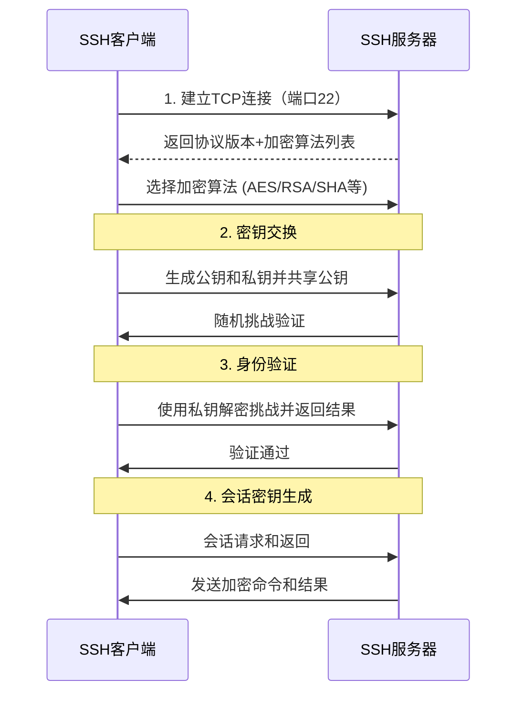

### SSH工作原理详解

#### 什么是SSH？

SSH（Secure Shell）是一种加密的网络协议，主要用于安全地远程登录和其他安全的网络服务。它能够保证数据传输的安全性，并提供多种功能，例如远程控制、文件传输和端口转发。

---

#### SSH功能模块

1. **远程控制**  
   通过SSH客户端与服务器进行远程操作，代替传统的Telnet协议。
   
2. **文件传输**  
   使用SCP（Secure Copy Protocol）或SFTP（SSH File Transfer Protocol）传输加密文件。
   
3. **端口转发**  
   SSH可以加密数据流并安全地转发端口，支持本地端口和远程端口转发。
   
4. **自动化脚本**  
   支持无密码登录，便于实现自动化任务。

---

#### SSH工作流程（配合图解）

---

#### 步骤详解

1. **建立TCP连接**  
   SSH客户端通过22端口与SSH服务器建立初始连接。

2. **协议版本和算法协商**  
   客户端和服务器交换支持的协议版本和加密算法列表，选择一个共同支持的加密算法（如AES或RSA）。

3. **密钥交换**  
   - 客户端生成公钥和私钥。
   - 客户端将公钥发送给服务器。
   - 服务器通过随机挑战验证客户端的私钥。

4. **身份验证**  
   - 客户端使用私钥解密服务器的随机挑战。
   - 服务器验证解密结果，确保客户端身份。

5. **会话密钥生成**  
   - 通过密钥交换生成会话密钥，用于后续通信的数据加密。

6. **加密通信**  
   - 客户端和服务器使用会话密钥进行数据加密传输。
   - 客户端发送命令，服务器返回加密结果。

---

#### SSH的优势

- **安全性**：数据经过加密，避免了窃听和中间人攻击。
- **多功能**：支持远程登录、文件传输、端口转发等。
- **灵活性**：支持密钥认证和基于密码的登录，兼具安全性和便利性。

---

希望此解析能帮助您深入理解SSH的核心工作原理！
