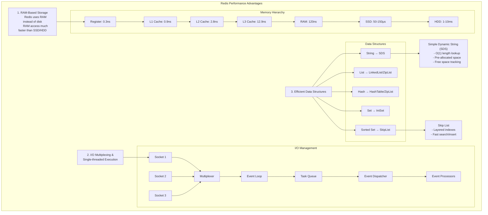

### 为什么Redis如此快速？

1. **基于RAM的存储**
   - Redis是一个基于RAM的存储系统。与随机磁盘访问相比，RAM访问的速度至少快1000倍。
   - 由于Redis主要使用RAM而不是磁盘，因此数据访问的延迟大幅降低。这使得Redis可以处理大量的快速数据请求（例如，每秒10万个请求）。

2. **I/O多路复用和单线程执行循环**
   - Redis通过I/O多路复用和单线程执行循环来提高执行效率。
   - 多路复用使得Redis可以同时管理多个连接，而单线程执行则避免了线程切换带来的开销，使得Redis能够在简化的单线程模型中实现高效的请求处理。

3. **高效的底层数据结构**
   - Redis利用多种高效的底层数据结构来管理不同类型的数据。
   - 例如，简单动态字符串（SDS）支持O(1)的字符串长度查询，并且预分配空间以减少内存分配操作的频率。
   - 跳表（Skip List）通过分层索引的方式提供快速查找的能力，适用于排序集合数据的管理。

---

Redis通过I/O多路复用和单线程执行循环来提高执行效率，主要体现在以下几个方面：

1. **I/O多路复用**
   - I/O多路复用技术使Redis可以在单个线程中同时处理多个客户端连接。
   - 通过将多个套接字（socket）的I/O操作集中在一起，Redis可以一次性检查多个连接的状态，从而避免了传统的多线程方式下频繁的线程切换。

2. **单线程执行模型**
   - Redis的执行模型是单线程的，这意味着所有的命令在一个线程中顺序执行，不存在并发的写操作。
   - 这种设计消除了数据竞争的风险，不需要加锁机制，从而避免了锁带来的复杂性和性能开销。
   - 单线程的Redis通过事件循环处理请求，避免了多线程环境下的锁争用问题，从而获得更高的执行效率。

3. **事件循环**
   - Redis使用事件循环来管理所有的网络请求和数据操作。
   - 当一个请求到达时，Redis将其放入事件队列中，事件循环会按顺序处理这些事件，确保请求的有序性和高效性。
   - 事件循环还允许Redis在处理当前请求的同时，监听其他连接的读写事件，从而实现了高并发的连接管理。

通过这些技术手段，Redis实现了高效的请求处理和响应能力，即使在单线程模型下也能够支持大量的并发请求。这使得Redis成为了一个高效、可靠的内存缓存和数据存储解决方案。

---

Here's a Mermaid diagram that translates the concepts from the image into Chinese. The diagram is represented using Mermaid syntax for better readability and a similar structure.

### Explanation in Chinese:

1. **基于RAM**：Redis主要使用RAM而非磁盘，访问速度大幅提升。例如，RAM的访问时间约为120ns，而SSD在50-150微秒之间，HDD则更慢。
   
2. **I/O多路复用与单线程执行**：通过多路复用技术集中管理多个套接字（socket），使用单线程事件循环高效地处理请求。事件循环负责调度任务队列中的事件，并通过分发器将任务传递给处理器。
   
3. **高效的数据结构**：Redis采用了多种优化的数据结构，例如简单动态字符串（SDS）用于快速字符串操作，跳表（Skip List）用于有序集合，以确保高效的存储和查找。

This diagram and explanation summarize why Redis is so efficient, by focusing on its memory-based storage, I/O multiplexing with a single-threaded model, and optimized data structures.
