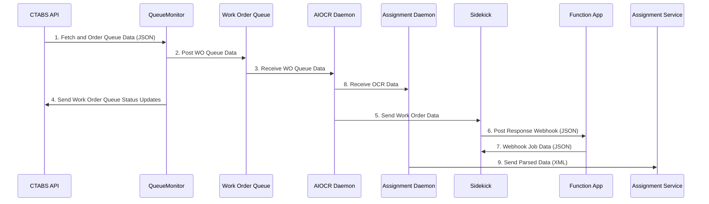

Here is a **Mermaid sequence diagram** that represents the workflow described above:

Here is a structured list of key content and descriptions from the provided diagram:

### **1. Windows Services**
- **Windows Scheduler**
  - **QueueMonitor:** Runs on a scheduled basis, reads data, and immediately drops it into a queue for later asynchronous processing. Runtime is expected to be short.

- **AIOCR Daemon**
  - Listens for incoming queue data.
  - Processes OCR-related tasks.

- **Assignment Daemon**
  - Listens to queues or topics for data processing.

---

### **2. Workflow Process**
1. **Fetch and Order Queue Data (JSON)**  
   - QueueMonitor fetches and organizes work order queue data from the **CTABS API**.

2. **Post Work Order (WO) Queue Data**  
   - The data is placed into the **Work Order Queue** in the **Message Bus**.

3. **Receive Work Order Queue Data**  
   - The **AIOCR Daemon** listens and retrieves WO queue data.

4. **Send Work Order Queue Status Updates**  
   - Updates are sent back to the **CTABS API**.

5. **Send Work Order Data**  
   - The **Sidekick** component processes and forwards work order data.

6. **Post Response Webhook (JSON)**  
   - Sidekick sends response data via webhook.

7. **Webhook Job Data (JSON)**  
   - Data is processed and sent to a **Function App**.

8. **Receive OCR Data**  
   - The **Assignment Daemon** listens for and retrieves OCR data.

9. **Send Parsed Data (XML)**  
   - The parsed data is sent to the **Assignment Service**.

---

### **3. External Components**
- **CTABS API**
  - Source for fetching queue data.
  - Involved in work order status updates.

- **Work Order Queue**
  - Acts as a queueing system for handling work order data.

- **Message Bus**
  - Manages communication between services.

- **Sidekick**
  - Handles work order data processing and response webhooks.

- **Function Apps**
  - Executes function code based on webhook job data.

- **Assignment Service**
  - Receives parsed XML data.

---

### **4. Legend (Symbols and Actions)**
- **Push/Post/Send** (Green Arrow)  
  - Data is actively sent to another service or queue.
  
- **Pull/Fetch/Listen** (Blue Arrow)  
  - Data is retrieved from a source, queue, or topic.

