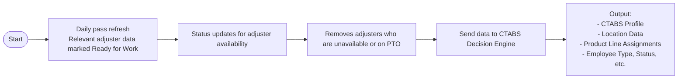
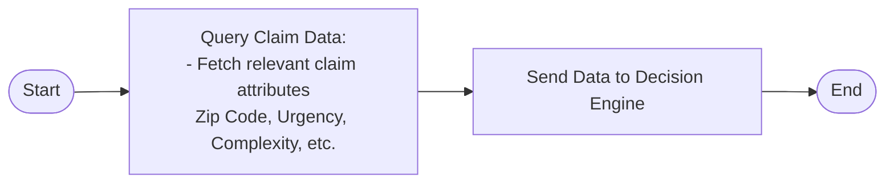
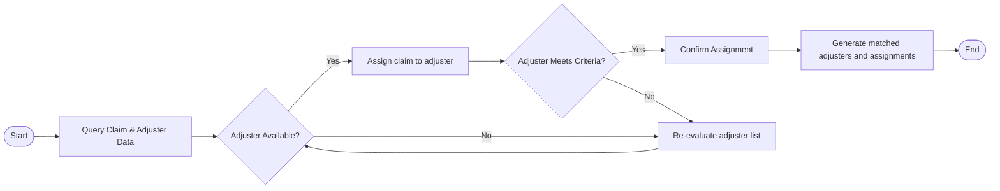

Here’s a **Mermaid diagram representation** for each part based on the provided image:

---

### **1. Adjuster Data Flow**

---

### **2. Claim Data Flow**

---

### **3. Decision Engine Flow**

---

These diagrams correspond to the individual sections in the image. Let me know if you'd like adjustments or to combine them!
