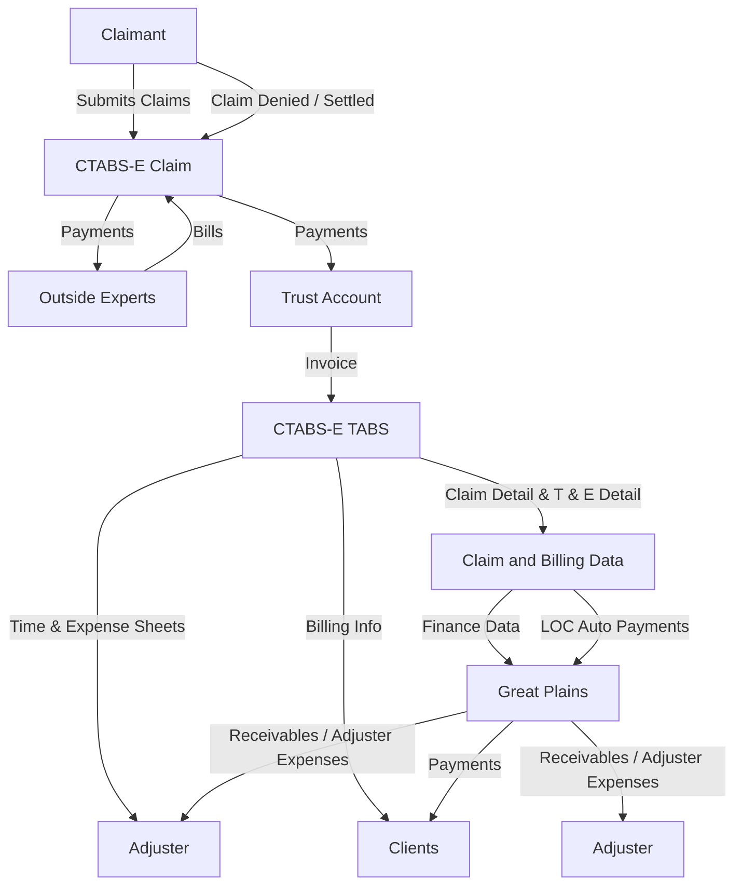
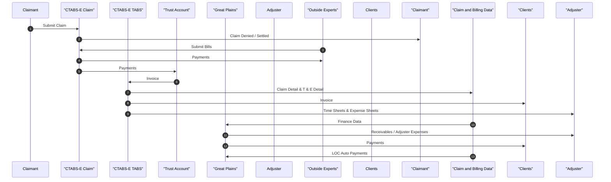

Below is the **Mermaid flowchart and sequence diagram** based on the data flow between **CTABS-E**, **Great Plains**, and other entities.

---

### **Mermaid Flowchart (Data Flow Diagram)**

---

### **Mermaid Sequence Diagram**

---

### **Description of the Flow**
1. **Claim Submission & Processing**
   - Claimants submit claims to **CTABS-E Claim**.
   - Claims can either be **settled** or **denied**.

2. **Expert Billing & Payments**
   - Outside experts submit **bills** to **CTABS-E Claim**.
   - Payments are processed and sent back to the **Outside Experts**.

3. **Trust Account & Invoice Generation**
   - **Trust Account** handles **payments** from **CTABS-E Claim**.
   - The **Trust Account** sends **invoices** to **CTABS-E TABS**.

4. **Billing & Adjuster Expenses**
   - **CTABS-E TABS** sends **Claim Detail & Expense Data** to **Claim and Billing Data**.
   - **Invoices** are generated and sent to **Clients**.
   - **Time and Expense sheets** are sent to **Adjusters**.

5. **Financial Integration with Great Plains**
   - **Claim and Billing Data** sends **Finance Data** to **Great Plains**.
   - **Great Plains** processes **Receivables & Adjuster Expenses**.
   - **Payments** are sent to **Clients**.
   - **LOC Auto Payments** are also handled through **Great Plains**.

This structured flow ensures claim processing, expert payments, financial handling, and integration with the accounting system (**Great Plains**). 

---
The image represents a **data flow diagram** between **CTABS-E** and **Great Plains** systems. Below is an organized breakdown of its **content** and **data flow**:

---

### **Entities & Systems:**
1. **CTABS-E Claim (Core System)**
2. **Claimant**
3. **Outside Experts**
4. **Trust Account**
5. **Clients**
6. **Adjuster**
7. **Great Plains (Financial System)**
8. **CTABS-E TABS (Billing & Expense System)**

---

### **Data Flow Description:**

#### **1. Claim Processing (CTABS-E Claim)**
   - **Claimant → CTABS-E Claim**: 
     - Submits Claims
     - Receives Claim Denial or Settlement
   - **Outside Experts → CTABS-E Claim**:
     - Submit Bills
     - Receive Payments

#### **2. Trust Account Processing**
   - **CTABS-E Claim → Trust Account**: Payments
   - **Trust Account → CTABS-E TABS**: Invoice

#### **3. Billing & Expense Management (CTABS-E TABS)**
   - **CTABS-E TABS → CTABS-E Claim**:
     - Sends Claim Details
   - **CTABS-E TABS → Clients**:
     - Sends Invoice
   - **CTABS-E TABS → Adjuster**:
     - Provides **Time Sheets** and **Expense Sheets**
   - **CT

- **CTABS-E TABS → Claim and Billing Data**:
  - Sends **Claim Detail** and **T & E (Time & Expense) Detail**
  - Provides **Billing Info**
  
#### **4. Financial Processing & Integration with Great Plains**
  - **Claim and Billing Data → Finance Data**
  - **Finance Data → Great Plains**:
    - Transfers **Receivables / Adjuster Expenses**
    - Includes **LOC Auto Payments**
  - **Great Plains → Adjuster**:
    - Processes **Payments**
  - **Great Plains → Clients**:
    - Handles **Receivables / Adjuster Expenses**
  
---

### **Summary of Data Flow**
1. **Claims are processed in CTABS-E Claim.**
2. **Invoices and payments are managed through CTABS-E TABS.**
3. **Financial transactions and receivables are sent to Great Plains.**
4. **Great Plains handles final payments and financial reconciliations.**

Would you like a structured table or visual representation of this flow?
