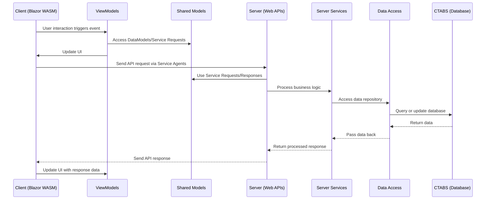

Here's a mermaid flowchart based on the architecture described above:

```mermaid
flowchart TD
    subgraph Shared
        A1[DataModels]
        A2[Service Requests/Responses]
    end

    subgraph Client["Client .NET 6"]
        B1[Blazor WASM]
        B2[Razor Components Views]
        B3[.NET]
        B4[WebAssembly]
        B5[ViewModels]
        B6[Client Services]
        B7[Service Agents]
        B8[Local Storage]
        B1 --> B2
        B2 --> B3
        B3 --> B4
        B5 --> B6
        B6 --> B8
        B5 --> B7
    end

    subgraph Server["Server .NET 6"]
        C1[Web APIs]
        C2[Server Services]
        C3[Data Access]
        C4[Unit Of Work]
        C5[Data Repository]
        C6[Entity Framework Core]
        C7[CTABS (Database)]
        C3 --> C4
        C4 --> C5
        C5 --> C6
        C6 --> C7
        C1 --> C2
        C2 --> C3
    end

    B7 --> C1
    A1 -.-> B5
    A1 -.-> C2
    A2 -.-> B7
    A2 -.-> C1

```

### Description:
1. **Shared**: Contains `DataModels` and `Service Requests/Responses` shared by both the client and server.
2. **Client**: Includes the Blazor WASM stack (`Razor Components`, `.NET`, and `WebAssembly`) and interacts with `ViewModels`, `Client Services`, `Service Agents`, and `Local Storage`.
3. **Server**: Handles `Web APIs`, `Server Services`, `Data Access` layers, and communicates with the `CTABS` database through `Entity Framework Core`.
4. Arrows indicate interactions and dependencies between components.

Here's the corresponding **mermaid sequence diagram** based on the architecture:



### Key Flow:
1. **Client Interaction**: The user interacts with the Blazor WASM frontend, triggering events handled by `ViewModels`.
2. **Data Handling**: The `ViewModels` may use shared models (`DataModels` or `Service Requests`) for preparing requests or updating the UI.
3. **API Communication**: The `Client` sends an API request to the `Server` through `Service Agents`.
4. **Server Processing**: The server processes the request using shared models, server services, and the data access layer.
5. **Database Interaction**: The `Data Access` layer interacts with the `CTABS` database via `Entity Framework Core`.
6. **Response Back to Client**: The response data flows back through the server, updating the client UI.

This sequence diagram visually represents the interaction flow between the components based on the architecture.

From this architecture diagram, the following content can be extracted:

### Shared
- **DataModels**: Models shared between the client and server.
- **Service Requests/Responses**: Definitions for service requests and responses.

---

### Client (.NET 6)
- **Blazor WASM** (WebAssembly):
  - **Razor Components (Views)**: Frontend view components.
  - **.NET**: Runs on the .NET framework.
  - **WebAssembly**: Enables cross-platform execution.
- **ViewModels**: Data models associated with client-side views.
- **Client Services**: Provides client-side service functionality.
- **Service Agents**: Proxy services to communicate with the server.
- **Local Storage**: Local storage solutions on the client side.

---

### Server (.NET 6)
- **Web APIs**: Provides service interfaces.
- **Server Services**: Implements server-side business logic.
- **Data Access**: The data access layer, which includes:
  - **Unit Of Work**: Manages transactions.
  - **Data Repository**: Data repository for operations.
  - **Entity Framework Core**: Framework for database interactions.
- **CTABS**: The backend database system.

This diagram illustrates a frontend-backend separation architecture based on Blazor WASM (WebAssembly) and .NET 6. The client interacts with the server through `ViewModels`, while the server accesses the database using Entity Framework Core and employs shared models for consistent requests and responses.
