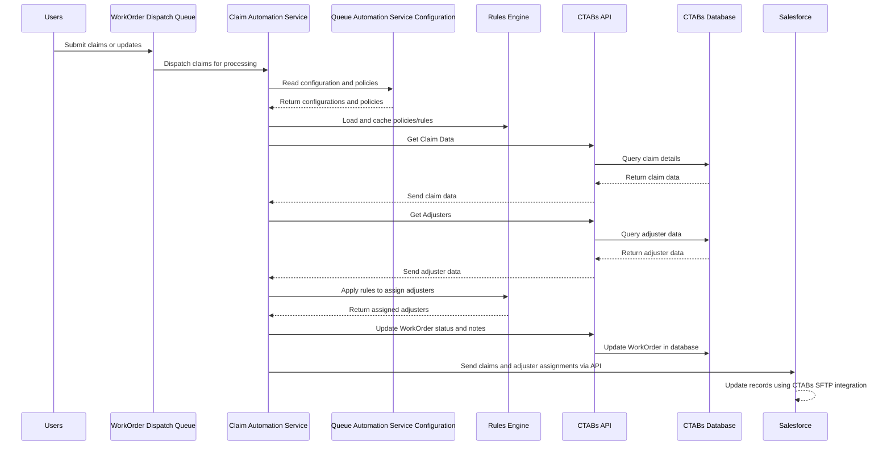

### Logical Flow with Sequence Diagram

Below is the **Mermaid Sequence Diagram** representing the logical flow:

### Explanation:
- **Users** initiate claims or updates that go to the **WorkOrder Dispatch Queue**.
- The **Claim Automation Service** processes claims, pulling configurations from the **Queue Automation Service Configuration** database and caching rules in the **Rules Engine**.
- The service retrieves claim and adjuster data from the **CTABs Database** via the **CTABs API**.
- The **Rules Engine** applies policies and assigns adjusters.
- Updated WorkOrder statuses and notes are sent back to the **CTABs Database**.
- Final claims and adjuster assignments are sent to **Salesforce** via an API for further processing and record updates.

This sequence diagram ensures a clear, step-by-step representation of the flow and interactions between the components. Let me know if any modifications are needed!
