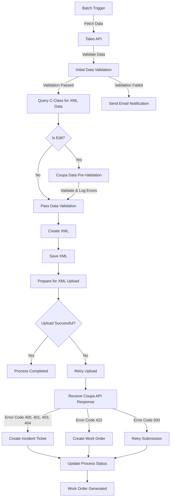
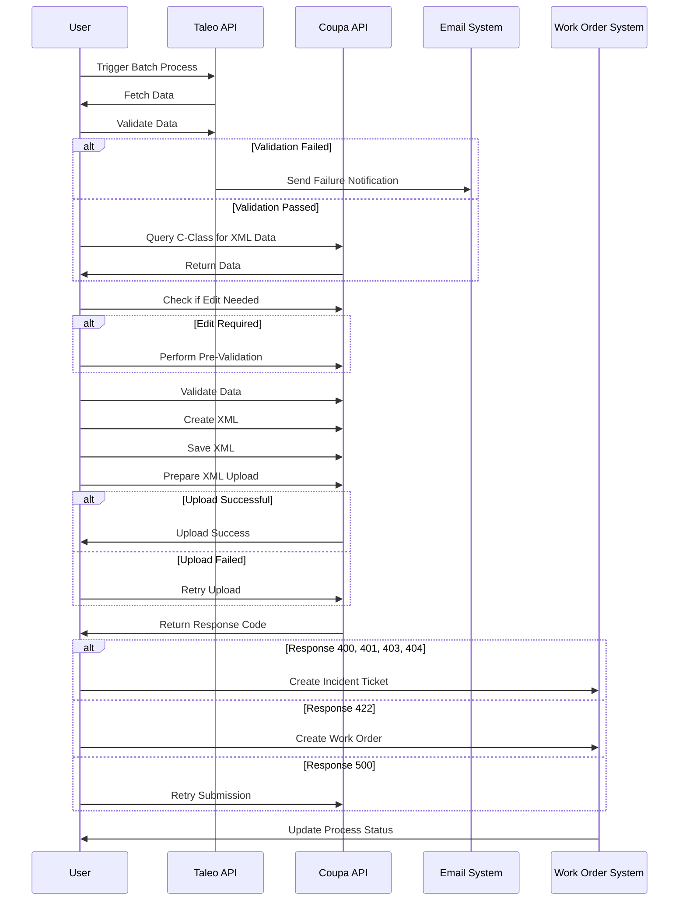
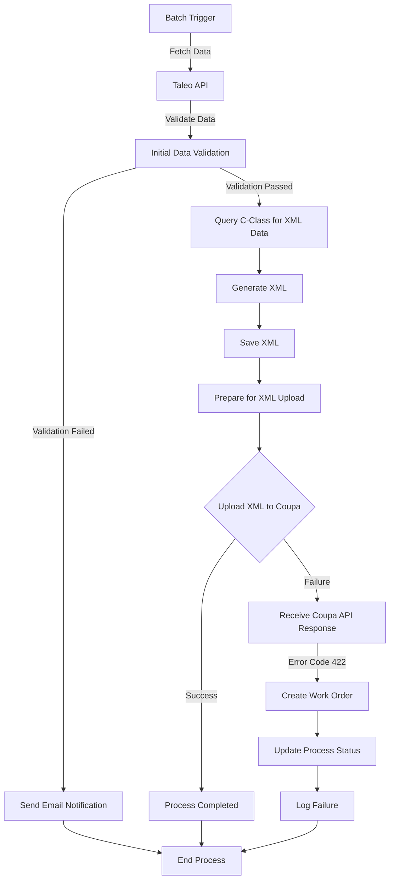
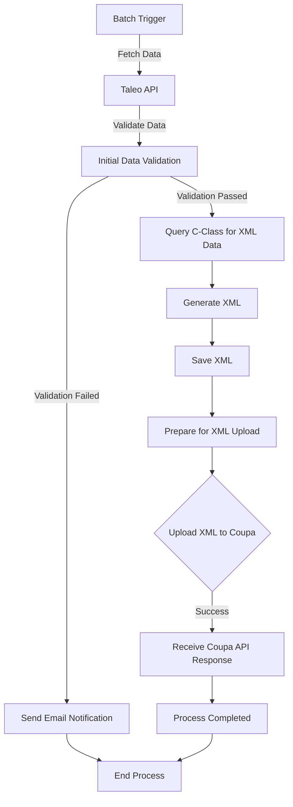
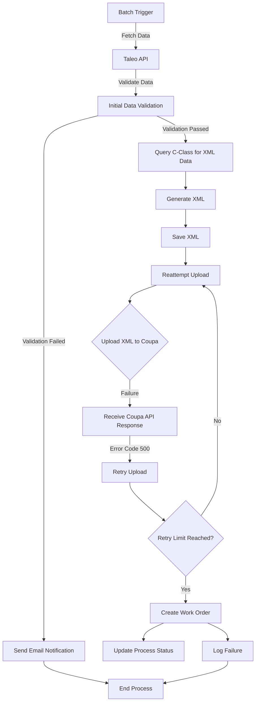

### **1. Batch Trigger and Initial Data Validation**
   - Process starts with a **batch trigger**.
   - The system fetches data via the **Taleo API**.
   - The retrieved data undergoes **initial validation**:
     - If validation fails:
       - **Failure message is sent via email**.
     - If validation succeeds:
       - Data proceeds to the next step.

### **2. Data Processing and Coupa Validation**
   - Query **C-Class** to fetch necessary data for XML fields.
   - Decision point: **“Is edit?”** 
     - If **No**, proceed without modifications.
     - If **Yes**, perform **Coupa Data Pre-validation**:
       - Ensures completeness, validity, and structure.
       - Logs errors if any.
   - **Data is validated before passing to Coupa**.

### **3. XML Generation and Storage**
   - **Create XML** based on validated data.
   - Save the XML.

### **4. Upload XML to Coupa Web Service**
   - XML file is prepared for upload.
   - If upload is **successful**, process completes.
   - If upload **fails**, retry logic is applied.

### **5. Response Handling from Coupa API**
   - If **Error Response Codes** received:
     - **400, 401, 403, 404** → Create **Incident Ticket**.
     - **422** → Create **Work Order**.
     - **500** → Retry submission or escalate issue.

### **6. Error Handling and Work Orders**
   - If failure persists, status updates to indicate process error.
   - **Work Order is generated** in case of failure.
   - Configurable **Taleo Work Order Validation** ensures process integrity.

This flowchart outlines a structured **data validation, transformation, and submission process** integrating **Taleo and Coupa systems**. Let me know if you need further details!

Here is the **Mermaid flowchart** and **sequence diagram** based on the extracted flow.

---

### **Mermaid Flowchart**

---

### **Mermaid Sequence Diagram**

Here is a **Mermaid flowchart** for a **specific use case**:  
**"Failed XML Upload due to Validation Error (Error Code 422)"**  

This scenario demonstrates the **data flow** from the **batch trigger** to **handling validation failure** and **creating a work order**.

---

### **Data Flow Breakdown:**
1. **Batch Trigger:** Starts the process.
2. **Taleo API:** Fetches the required data.
3. **Data Validation:** If validation fails, an **email notification** is sent, and the process stops.
4. **Query C-Class & Generate XML:** If validation passes, data is **processed** into an XML file.
5. **XML Upload to Coupa:** 
   - If **successful**, the process ends.
   - If **failed**, a response is received.
6. **Error Handling (Error Code 422):** 
   - A **Work Order** is created.
   - The system **logs the failure** and updates the process status.

---

This use case focuses on a **failure scenario** where **XML upload fails due to validation errors**, requiring a **work order** to resolve the issue.

Here are the **Mermaid flowcharts** for the two additional use cases:

---

### **1️⃣ Use Case: Successful XML Upload**  
This scenario demonstrates the **normal workflow** where the XML file is successfully uploaded to Coupa without issues.

---

### **2️⃣ Use Case: Retry Logic for API Failures (Error Code 500)**  
This scenario covers the **failure case** where Coupa returns **Error Code 500** (Internal Server Error), triggering **automatic retries**.

---

### **Summary of the Three Cases:**
1. **Successful Upload:**  
   - Data flows smoothly from Taleo API → XML generation → Coupa upload → Process completion.
  
2. **Validation Failure (Error 422):**  
   - An issue in XML validation causes the system to create a **Work Order** and log the failure.
  
3. **Retry on API Failure (Error 500):**  
   - The system retries failed uploads **until a limit is reached**, then escalates the issue by creating a **Work Order**.

