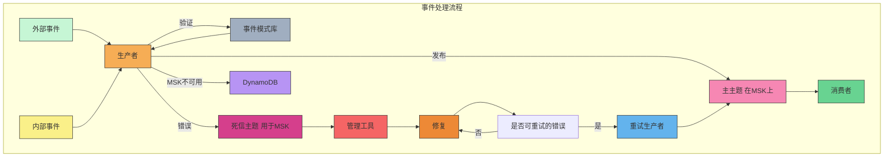

### 事件处理流程 McDonald Event-Driven Architecture

### 关键流程说明

1. **外部事件和内部事件**：外部和内部事件都发送到“生产者”组件进行处理。
   
2. **事件验证**：生产者将事件发送到“事件模式库”进行验证，以确保事件符合模式要求。

3. **发布到主主题**：验证通过的事件发布到主主题（在 MSK 上），然后被消费者处理。

4. **错误处理**：如果生产者在发布时遇到错误，事件将发送到“死信主题”，用于错误跟踪和后续操作。

5. **管理工具和修复**：管理工具从死信主题中提取错误事件，决定是否进行修复。

6. **重试机制**：如果错误是可重试的，将事件发送到“重试生产者”进行重试发布。

7. **DynamoDB 备份**：在MSK不可用时，事件会存储在DynamoDB中，以备后续处理。

### 组件说明

- **事件模式库**：存储事件的模式，用于事件验证。
- **死信主题**：存储处理失败的事件，以便进行审查或重试。
- **管理工具**：分析错误并决定是否重试或修复。
- **DynamoDB**：在主系统不可用时用于备份数据。

该Mermaid图展示了事件的处理流程，包含事件发布、错误处理、重试机制和备份存储的关键步骤。
