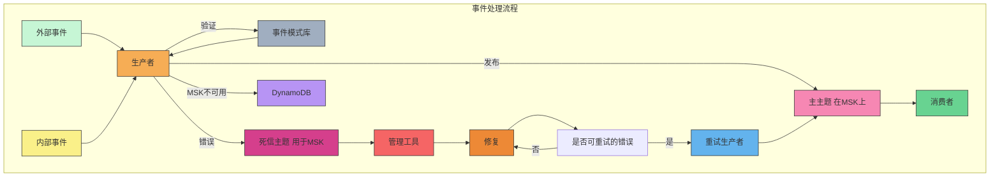
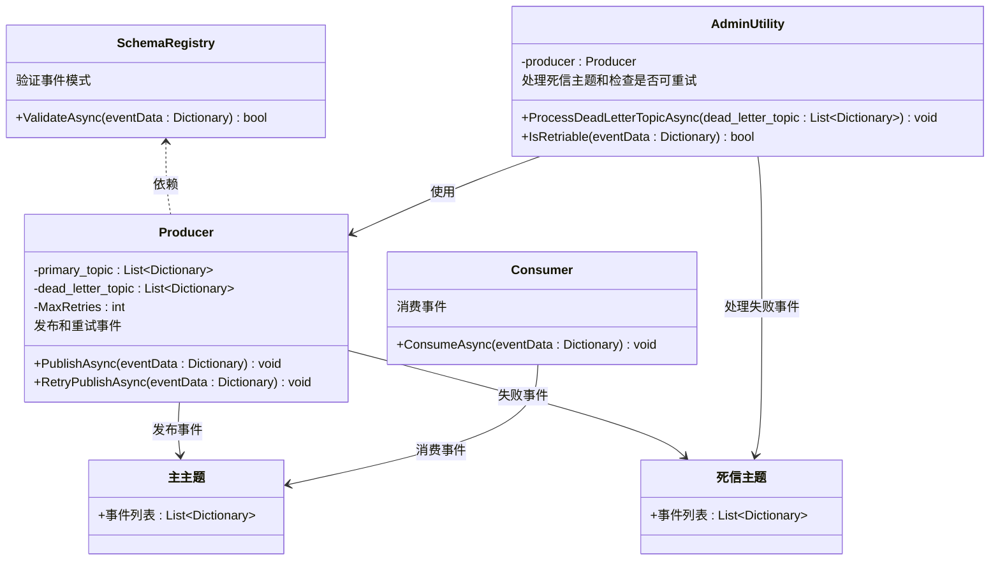

### 事件处理流程 McDonald Event-Driven Architecture



### 关键流程说明

1. **外部事件和内部事件**：外部和内部事件都发送到“生产者”组件进行处理。
   
2. **事件验证**：生产者将事件发送到“事件模式库”进行验证，以确保事件符合模式要求。

3. **发布到主主题**：验证通过的事件发布到主主题（在 MSK 上），然后被消费者处理。

4. **错误处理**：如果生产者在发布时遇到错误，事件将发送到“死信主题”，用于错误跟踪和后续操作。

5. **管理工具和修复**：管理工具从死信主题中提取错误事件，决定是否进行修复。

6. **重试机制**：如果错误是可重试的，将事件发送到“重试生产者”进行重试发布。

7. **DynamoDB 备份**：在MSK不可用时，事件会存储在DynamoDB中，以备后续处理。

### 组件说明

- **事件模式库**：存储事件的模式，用于事件验证。
- **死信主题**：存储处理失败的事件，以便进行审查或重试。
- **管理工具**：分析错误并决定是否重试或修复。
- **DynamoDB**：在主系统不可用时用于备份数据。

该图展示了事件的处理流程，包含事件发布、错误处理、重试机制和备份存储的关键步骤。

---

以下是使用C#和异步编程 (`async` / `await`) 重新实现上述事件处理流程的代码。我们将模拟事件的验证、发布、错误处理、重试和死信机制。此代码使用 `async` 方法来模拟异步事件处理，以提高代码效率。

```csharp
using System;
using System.Collections.Generic;
using System.Threading.Tasks;

namespace EventProcessingDemo
{
    // 模拟模式注册库，用于事件验证
    public class SchemaRegistry
    {
        public static async Task<bool> ValidateAsync(Dictionary<string, string> eventData)
        {
            await Task.Delay(100);  // 模拟异步操作
            if (eventData.ContainsKey("type") && eventData.ContainsKey("data"))
            {
                Console.WriteLine($"事件验证通过: {eventData}");
                return true;
            }
            Console.WriteLine("事件验证失败。");
            return false;
        }
    }

    // 生产者类，用于发布事件
    public class Producer
    {
        private readonly List<Dictionary<string, string>> _primaryTopic;
        private readonly List<Dictionary<string, string>> _deadLetterTopic;
        private const int MaxRetries = 3;

        public Producer(List<Dictionary<string, string>> primaryTopic, List<Dictionary<string, string>> deadLetterTopic)
        {
            _primaryTopic = primaryTopic;
            _deadLetterTopic = deadLetterTopic;
        }

        public async Task PublishAsync(Dictionary<string, string> eventData)
        {
            Console.WriteLine($"发布事件: {eventData}");
            if (new Random().Next(2) == 0)  // 随机模拟发布成功或失败
            {
                Console.WriteLine("事件发布成功。");
                _primaryTopic.Add(eventData);
            }
            else
            {
                Console.WriteLine("发布失败。将事件发送到死信主题。");
                _deadLetterTopic.Add(eventData);
            }
        }

        public async Task RetryPublishAsync(Dictionary<string, string> eventData)
        {
            for (int attempt = 1; attempt <= MaxRetries; attempt++)
            {
                Console.WriteLine($"重试第 {attempt} 次发布事件: {eventData}");
                if (new Random().Next(2) == 0)  // 随机模拟重试成功
                {
                    Console.WriteLine("重试成功。事件已发布。");
                    _primaryTopic.Add(eventData);
                    return;
                }
                await Task.Delay(1000);  // 模拟重试之间的延迟
            }
            Console.WriteLine("达到最大重试次数。事件移至死信主题。");
            _deadLetterTopic.Add(eventData);
        }
    }

    // 消费者类，从主主题中消费事件
    public class Consumer
    {
        public async Task ConsumeAsync(Dictionary<string, string> eventData)
        {
            Console.WriteLine($"消费事件: {eventData}");
            await Task.Delay(1000);  // 模拟事件处理
            Console.WriteLine("事件处理成功。");
        }
    }

    // 管理工具类，用于处理死信主题中的事件
    public class AdminUtility
    {
        private readonly Producer _producer;

        public AdminUtility(Producer producer)
        {
            _producer = producer;
        }

        public async Task ProcessDeadLetterTopicAsync(List<Dictionary<string, string>> deadLetterTopic)
        {
            Console.WriteLine("处理死信主题中的事件...");
            foreach (var eventData in new List<Dictionary<string, string>>(deadLetterTopic))  // 拷贝列表，避免在迭代时修改
            {
                if (IsRetriable(eventData))
                {
                    Console.WriteLine($"从死信主题重试事件: {eventData}");
                    await _producer.RetryPublishAsync(eventData);
                    deadLetterTopic.Remove(eventData);
                }
                else
                {
                    Console.WriteLine($"事件不可重试，需要人工干预: {eventData}");
                }
            }
        }

        private static bool IsRetriable(Dictionary<string, string> eventData)
        {
            // 随机决定是否可重试
            return new Random().Next(2) == 0;
        }
    }

    class Program
    {
        static async Task Main(string[] args)
        {
            // 模拟主主题、死信主题和DynamoDB备份
            var primaryTopic = new List<Dictionary<string, string>>();
            var deadLetterTopic = new List<Dictionary<string, string>>();

            // 初始化各组件
            var schemaRegistry = new SchemaRegistry();
            var producer = new Producer(primaryTopic, deadLetterTopic);
            var consumer = new Consumer();
            var adminUtility = new AdminUtility(producer);

            // 模拟事件处理流程
            var events = new List<Dictionary<string, string>>
            {
                new Dictionary<string, string> { { "type", "order" }, { "data", "Order123" } },
                new Dictionary<string, string> { { "type", "payment" }, { "data", "Payment456" } },
                new Dictionary<string, string> { { "data", "不完整的事件" } },  // 无效事件（缺少 'type' 字段）
            };

            // 处理事件的流程
            foreach (var eventData in events)
            {
                Console.WriteLine("\n处理新事件...");
                if (await SchemaRegistry.ValidateAsync(eventData))
                {
                    try
                    {
                        await producer.PublishAsync(eventData);
                    }
                    catch (Exception ex)
                    {
                        Console.WriteLine($"发生异常: {ex.Message}");
                        deadLetterTopic.Add(eventData);
                    }
                }
                else
                {
                    Console.WriteLine("事件未通过模式验证，被丢弃。");
                }
            }

            // 消费成功发布的事件
            Console.WriteLine("\n从主主题消费事件:");
            foreach (var eventData in primaryTopic)
            {
                await consumer.ConsumeAsync(eventData);
            }

            // 对死信主题中的事件进行重试处理
            Console.WriteLine("\n管理工具处理死信主题中的事件:");
            await adminUtility.ProcessDeadLetterTopicAsync(deadLetterTopic);

            // 输出主主题和死信主题的最终状态
            Console.WriteLine("\n最终状态:");
            Console.WriteLine("主主题事件:");
            foreach (var eventData in primaryTopic)
            {
                Console.WriteLine(eventData);
            }

            Console.WriteLine("死信主题事件:");
            foreach (var eventData in deadLetterTopic)
            {
                Console.WriteLine(eventData);
            }
        }
    }
}
```

### 代码说明

1. **SchemaRegistry (模式注册库)**：使用 `ValidateAsync` 方法验证事件的模式。此方法是异步的，模拟检查事件的结构是否符合要求。

2. **Producer (生产者)**：用于发布事件。
   - `PublishAsync` 方法尝试将事件发布到主主题，发布成功或失败由随机数决定。
   - `RetryPublishAsync` 方法用于对失败的事件进行重试发布，最多尝试 3 次。

3. **Consumer (消费者)**：从主主题中消费事件，使用 `ConsumeAsync` 方法模拟事件处理。

4. **AdminUtility (管理工具)**：处理死信主题中的事件。
   - `ProcessDeadLetterTopicAsync` 方法从死信主题中读取事件，并判断是否可重试。如果可重试，则调用 `RetryPublishAsync` 方法进行重试。
   - `IsRetriable` 方法使用随机数判断是否可以重试。

5. **Program (主程序)**：
   - 创建了一个事件列表并依次验证、发布每个事件。
   - 成功发布的事件将被消费，失败的事件将进入死信主题。
   - 管理工具处理死信主题中的事件，并尝试重试发布。

该代码使用 `async` 和 `await` 实现异步操作，提高了事件处理的效率。


