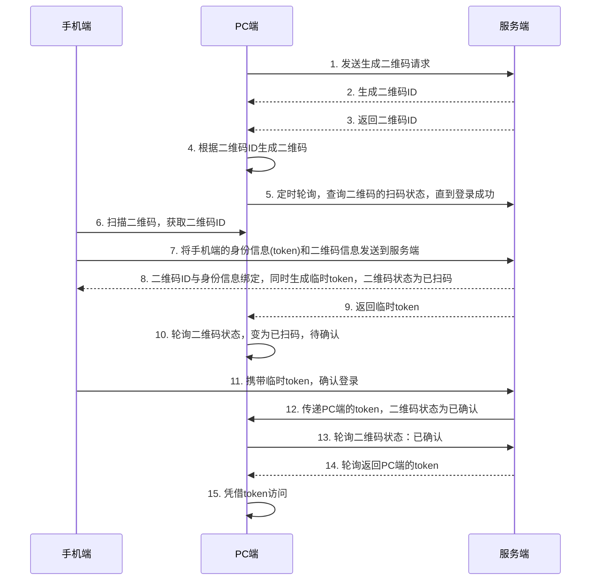

### 二维码登录流程

以下是基于图示的二维码登录流程的Mermaid序列图中文描述：

### 二维码登录流程步骤说明：

1. **PC端请求生成二维码**：PC端发送请求生成二维码。
2. **服务端生成二维码ID**：服务端生成一个二维码ID，并将其返回给PC端。
3. **PC端生成二维码**：PC端根据二维码ID生成二维码。
4. **轮询二维码状态**：PC端定时向服务端轮询二维码的扫码状态，直到登录成功。
5. **手机端扫码**：手机端扫描二维码，获取二维码ID。
6. **发送身份信息**：手机端将其身份信息（token）和二维码ID发送至服务端。
7. **绑定身份并生成临时token**：服务端将二维码ID与手机身份信息绑定，同时生成一个临时token，并将二维码状态更新为“已扫码”。
8. **返回临时token**：服务端返回临时token给PC端，PC端获取到已扫码状态。
9. **确认登录**：手机端携带临时token确认登录。
10. **生成PC端token**：服务端生成PC端最终token，并更新二维码状态为“已确认”。
11. **轮询确认状态**：PC端轮询服务端以确认二维码状态，接收最终token。
12. **PC端凭token访问**：PC端使用接收到的token访问应用。

该序列图完整地描述了手机端、PC端和服务端在二维码登录过程中各个步骤的交互流程。
