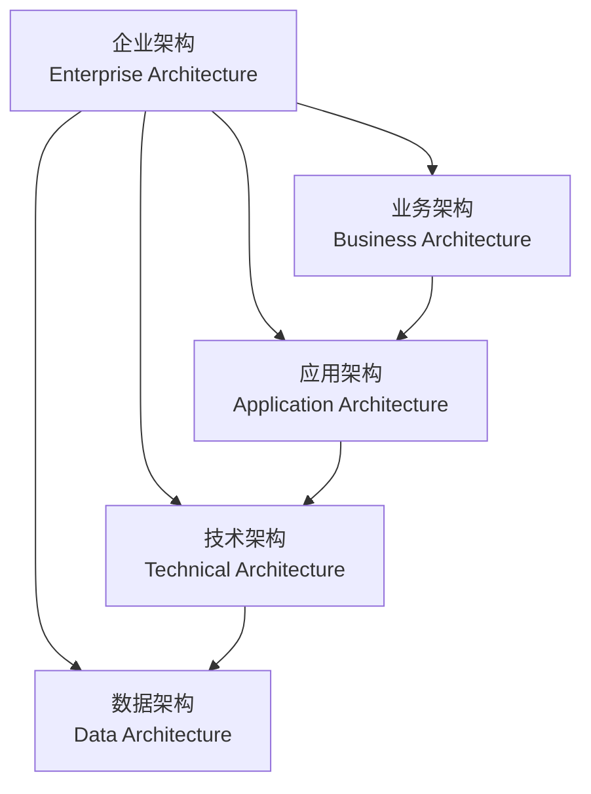
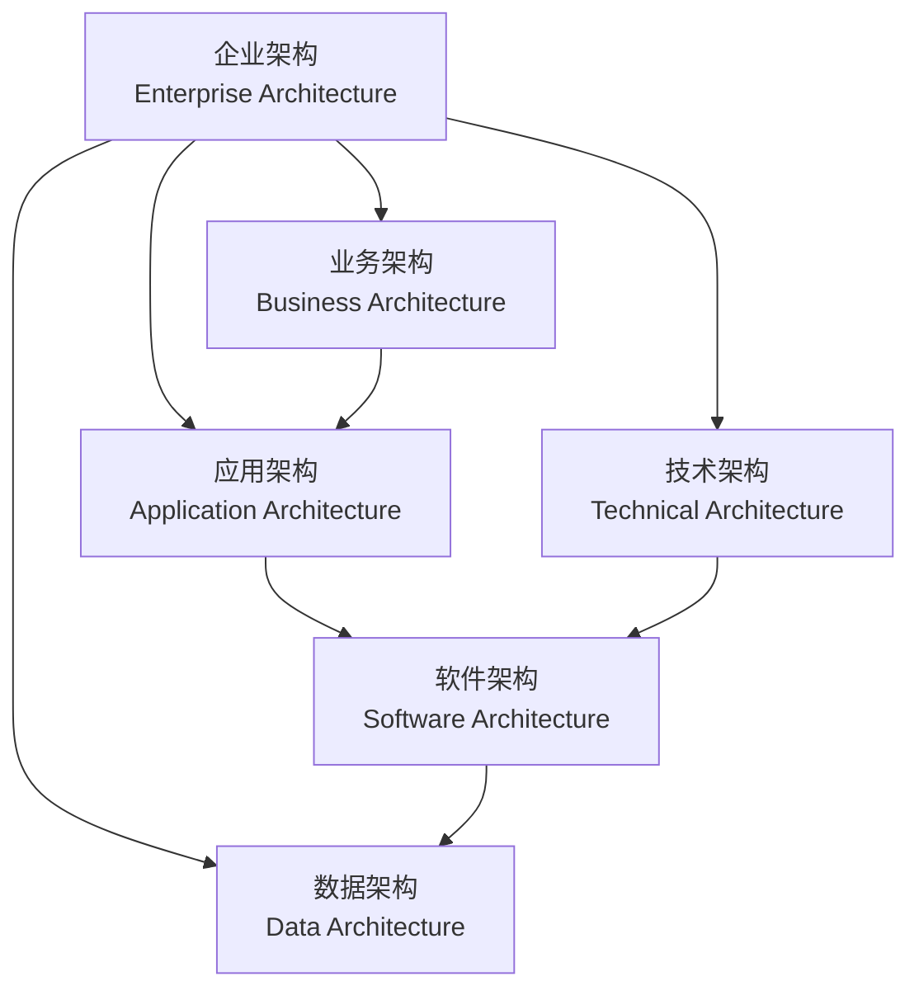

### “企业架构（Enterprise Architecture）”中四个主要层次的关键点详细解释：

---

### 流程图解释：
1. **EA（企业架构）** 是顶层框架，涵盖所有其他架构。
2. **BA（业务架构）** 定义战略目标和业务流程，是其他架构的起点。
3. **AA（应用架构）** 基于业务架构的需求，定义应用系统的支持方案。
4. **TA（技术架构）** 提供运行应用程序的技术基础设施。
5. **DA（数据架构）** 作为底层支撑，为所有其他层次提供可靠的数据管理。

---

### 1. **业务架构 (Business Architecture)**
- **关键点**：
  - 描述企业的核心业务功能和流程。
  - 定义企业的战略目标、关键绩效指标 (KPIs)，以及如何通过业务能力实现这些目标。
  - 强调业务需求和技术解决方案之间的对齐。

- **详细解释**：
  业务架构是企业架构的顶层部分，主要关注企业的商业目标和运营模式。通过明确业务架构，企业可以确保其技术系统和资源有效地支持其运营目标。例如，在零售企业中，业务架构可能包括客户管理、库存管理和销售管理的流程。

---

### 2. **应用架构 (Application Architecture)**
- **关键点**：
  - 定义企业所需的软件应用程序及其相互关系。
  - 关注应用程序如何支持业务功能。
  - 涉及应用程序之间的交互以及它们如何与技术架构对接。

- **详细解释**：
  应用架构侧重于企业的软件体系结构。它确保企业的应用程序能高效、可靠地运行，并能满足不断变化的业务需求。例如，一个企业的应用架构可能包括ERP系统、CRM系统，以及它们之间的数据交互。

---

### 3. **技术架构 (Technical Architecture)**
- **关键点**：
  - 涉及底层技术基础设施，包括硬件、网络和中间件。
  - 提供运行应用程序和存储数据的支持。
  - 确保系统的性能、可靠性和安全性。

- **详细解释**：
  技术架构定义了企业技术环境的蓝图。它包括服务器、存储、网络以及支撑这些硬件的软件组件。强大的技术架构能帮助企业快速响应市场变化，支持灵活的应用架构。

---

### 4. **数据架构 (Data Architecture)**
- **关键点**：
  - 描述企业的数据流、存储和管理策略。
  - 定义数据的结构、来源和目标。
  - 确保数据的完整性、安全性和可用性。

- **详细解释**：
  数据架构是企业架构的基础层，它决定了如何收集、存储、管理和利用数据来支持业务需求。例如，一个电商平台的数据架构可能包括用户数据、交易数据和产品数据的管理，以及这些数据的分析和可视化。

---

### 总结
这四个层次从战略到技术逐级深入，形成了一个互相支持的整体：
- **业务架构**定义了目标；
- **应用架构**提供了实现目标的工具；
- **技术架构**提供了运行这些工具的环境；
- **数据架构**为所有层次提供支撑的数据基础。

通过结合这些架构层次，企业能够更系统、更高效地实现其战略目标。

---

在上述图片中，“**软件架构（Software Architecture）**”并未明确单独标出，但它通常属于**应用架构（Application Architecture）**和**技术架构（Technical Architecture）**的交集部分。

### 详细分析：
1. **应用架构（Application Architecture）**：
   - 定义软件系统如何支持业务功能。
   - 涉及软件的功能设计、模块划分以及应用程序之间的交互。
   - 软件架构在这里体现为应用系统的设计模式，例如微服务架构、单体架构等。

2. **技术架构（Technical Architecture）**：
   - 涉及支持软件运行的底层技术，例如服务器、网络、中间件等。
   - 软件架构也依赖技术架构中的硬件和技术环境（如容器、虚拟化）来运行和交付。

### **软件架构的位置**
- 软件架构横跨应用架构和技术架构之间：
  - 它定义了软件的结构设计（如模块、组件、接口、依赖关系）。
  - 它需要应用架构提供的功能需求支持，同时依赖技术架构提供的底层技术支持。
  - 因此，软件架构可以被视为连接**应用架构**和**技术架构**的桥梁。

在企业架构的整体框架中，**软件架构**可以作为应用和技术之间的具体实现部分来理解。

### 流程图解释：

1. **EA (企业架构)**：顶层框架，包含所有架构层。
2. **BA (业务架构)**：定义战略目标和业务需求，是软件需求的来源。
3. **AA (应用架构)**：
   - 定义应用系统如何支持业务需求。
   - 提供软件架构的功能性支持。
4. **TA (技术架构)**：
   - 提供运行软件的底层技术环境（硬件、网络、平台）。
   - 软件架构依赖技术架构运行。
5. **SA (软件架构)**：
   - 位于应用架构和技术架构之间，起到桥梁作用。
   - 负责设计应用程序的模块、接口和组件，并确保它们在技术环境中运行。
6. **DA (数据架构)**：
   - 提供数据支撑，软件架构设计需要依赖数据模型和管理策略。

---

### **总结**：
- **软件架构（Software Architecture）** 是 **应用架构（Application Architecture）** 的具体实现，同时依赖 **技术架构（Technical Architecture）** 提供的环境支持。
- 它连接业务需求（从应用架构中获取）和底层技术（从技术架构中获取），同时利用数据架构来管理和处理数据流。
