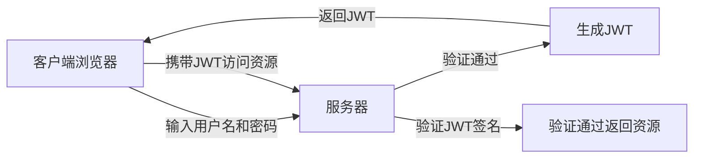
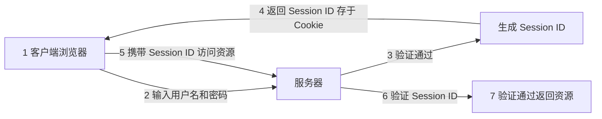
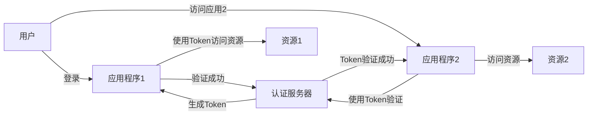
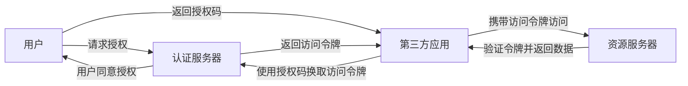

### 四种常见的身份认证与授权机制

Based on the "四种常见的身份认证与授权机制" (Four Common Authentication and Authorization Mechanisms), 
here is a detailed explanation along with flowchart representation for each mechanism in Chinese.

---

### 1. JWT (JSON Web Token) - 无状态授权机制

JWT 是一种无状态的授权机制，适合无状态的应用。JWT 由三个部分组成：Header、Payload、Signature。用户登录后，服务器会生成一个 JWT 并返回给客户端，客户端在每次请求时携带此令牌，服务器通过验证 JWT 来识别用户身份。

### 2. Session - 有状态授权机制

Session 是一种有状态的授权机制，服务器在用户登录成功后生成一个会话 ID，并将其存储在服务器端，同时通过 Cookie 将此 ID 返回给客户端。客户端在后续请求中会携带此 Cookie，服务器验证会话 ID 来识别用户身份。

### 3. SSO (Single Sign-On) - 单点登录机制

SSO 是一种无状态的授权机制，允许用户使用一个账户在多个应用之间无缝登录。用户在一个应用中登录后，其凭证可以被其他应用验证，从而免去重复登录的需求。

### 4. OAuth 2.0 - 授权机制

OAuth 2.0 是一种授权框架，允许用户将对资源的访问权限授予第三方应用程序，而无需暴露用户的凭据。用户首先通过认证服务器进行验证，然后认证服务器颁发授权令牌，第三方应用使用该令牌来访问资源服务器上的数据。

---

### Explanation of Each Mechanism in Chinese

1. **JWT (JSON Web Token)**：
   - **无状态**：JWT 是无状态的，适用于需要分布式扩展的场景。
   - **组成**：JWT 由 Header（头部）、Payload（负载）和 Signature（签名）构成。
   - **流程**：用户登录后服务器生成 JWT，并在每次请求时携带此令牌，由服务器验证签名后返回资源。

2. **Session**：
   - **有状态**：Session 需要服务器维护用户的会话信息。
   - **流程**：用户登录后服务器生成 Session ID，保存在服务器端，客户端通过 Cookie 携带 Session ID，在后续请求中服务器验证此 ID 来进行授权。

3. **SSO (Single Sign-On)**：
   - **单点登录**：SSO 允许用户使用一次登录来访问多个应用程序。
   - **流程**：用户在一个应用登录后，其他关联应用可以通过共享的认证服务器进行登录验证，实现跨应用访问。

4. **OAuth 2.0**：
   - **授权**：OAuth 2.0 允许用户授权第三方应用访问其资源，而无需暴露凭证。
   - **流程**：用户通过认证服务器授权，第三方应用获取访问令牌，凭此令牌访问资源服务器上的数据。

这些流程图和解释帮助我们更好地理解四种常见的身份认证与授权机制的原理及适用场景。
