### 大数据管道（Big Data Pipeline）在AWS、Azure和GCP上的Mermaid图：

```mermaid
graph TD

    subgraph AWS
        AWS_IOT[AWS IoT]
        Lambda_AWS[Lambda]
        Glacier[Glacier]
        S3[S3]
        Glue_ETL[Glue ETL]
        EMR[EMR]
        SageMaker[SageMaker]
        Kinesis_Analytics[Kinesis Analytics]
        Kinesis_Stream[Kinesis Stream]
        Redshift[Redshift]
        RDS[RDS]
        DynamoDB[DynamoDB]
        Elasticsearch[Elasticsearch]
        Athena[Athena]
        QuickSight[QuickSight]

        AWS_IOT --> Kinesis_Stream
        Kinesis_Stream --> Lambda_AWS
        Lambda_AWS --> Glue_ETL
        S3 --> Glue_ETL
        Glacier --> S3
        Glue_ETL --> EMR
        EMR --> SageMaker
        EMR --> Kinesis_Analytics
        Redshift --> QuickSight
        RDS --> QuickSight
        DynamoDB --> QuickSight
        Elasticsearch --> QuickSight
        Athena --> QuickSight
    end

    subgraph Azure
        IOT_Hub[IoT Hub]
        Event_Hub[Event Hub]
        Azure_Function[Azure Function]
        Data_Lake[Azure Data Lake Store]
        Data_Explorer[Data Explorer]
        Stream_Analytics[Stream Analytics]
        Databricks[Databricks]
        Azure_ML[Azure ML]
        CosmosDB[CosmosDB]
        Azure_Redis[Azure Redis]
        Azure_SQL[Azure SQL]
        Power_BI[Power BI]

        IOT_Hub --> Event_Hub
        Event_Hub --> Azure_Function
        Azure_Function --> Data_Lake
        Data_Lake --> Data_Explorer
        Data_Explorer --> Stream_Analytics
        Stream_Analytics --> Databricks
        Databricks --> Azure_ML
        Azure_ML --> Power_BI
        CosmosDB --> Azure_Redis
        Azure_Redis --> Azure_ML
        Azure_SQL --> Power_BI
    end

    subgraph GCP
        Cloud_IOT[Cloud IoT]
        Cloud_Function[Cloud Function]
        Cloud_Storage[Cloud Storage]
        DataPrep[DataPrep]
        DataFlow[DataFlow]
        PubSub[PubSub]
        DataProc[DataProc]
        AutoML[AutoML]
        BigQuery[BigQuery]
        DataStore[Datastore]
        BigTable[Big Table]
        MemoryStore[MemoryStore]
        CloudSQL[Cloud SQL]
        Colab[Colab]
        DataLab[DataLab]

        Cloud_IOT --> PubSub
        PubSub --> Cloud_Function
        Cloud_Function --> DataFlow
        Cloud_Storage --> DataFlow
        DataPrep --> DataFlow
        DataFlow --> DataProc
        DataProc --> AutoML
        AutoML --> BigQuery
        BigQuery --> DataLab
        DataStore --> BigQuery
        BigTable --> BigQuery
        MemoryStore --> BigQuery
        CloudSQL --> Colab
    end
```

### 各部分说明

#### AWS

- **数据摄取 (Ingestion)**: AWS IoT、Kinesis Stream、Lambda、S3
- **数据湖 (Data Lake)**: S3、Glacier
- **计算 (Computation)**: Glue ETL、EMR、SageMaker、Kinesis Analytics
- **数据仓库 (Data Warehouse)**: Redshift、RDS、DynamoDB、Elasticsearch
- **展示 (Presentation)**: Athena、QuickSight

#### Azure

- **数据摄取 (Ingestion)**: IoT Hub、Event Hub、Azure Function
- **数据湖 (Data Lake)**: Azure Data Lake Store
- **计算 (Computation)**: Data Explorer、Stream Analytics、Databricks、Azure ML
- **数据仓库 (Data Warehouse)**: CosmosDB、Azure SQL、Azure Redis
- **展示 (Presentation)**: Power BI

#### GCP

- **数据摄取 (Ingestion)**: Cloud IoT、PubSub、Cloud Function
- **数据湖 (Data Lake)**: Cloud Storage
- **计算 (Computation)**: DataFlow、DataProc、AutoML
- **数据仓库 (Data Warehouse)**: BigQuery、Datastore、Big Table、MemoryStore、Cloud SQL
- **展示 (Presentation)**: Colab、DataLab

### 图示注解

该图展示了AWS、Azure和Google Cloud Platform（GCP）上的大数据管道组件，并按不同的数据处理阶段进行了分类：
- **数据摄取**: 捕获和传输数据的服务。
- **数据湖**: 用于存储大规模数据集的存储解决方案。
- **计算**: 数据处理和分析工具。
- **数据仓库**: 优化查询和分析的数据存储。
- **展示**: 可视化和商业智能工具。

这个架构适用于数据工程和大数据处理的常见用例，每个云提供商都提供了类似功能的独特工具，以满足不同的数据处理需求。
