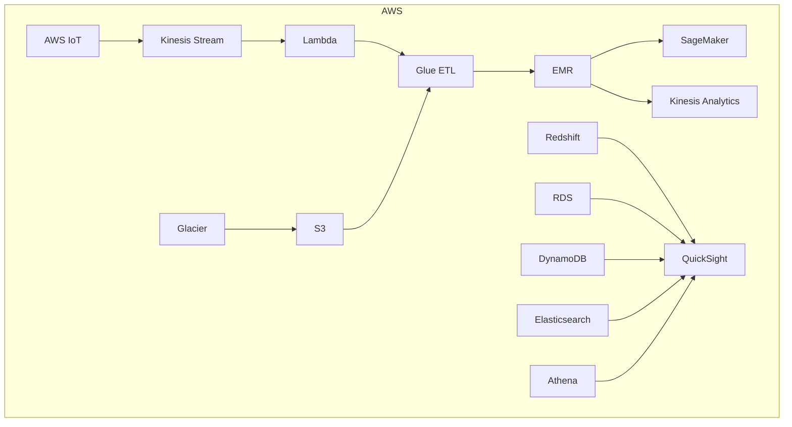
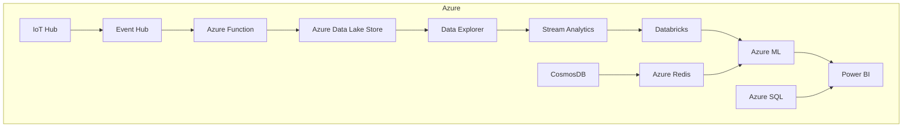
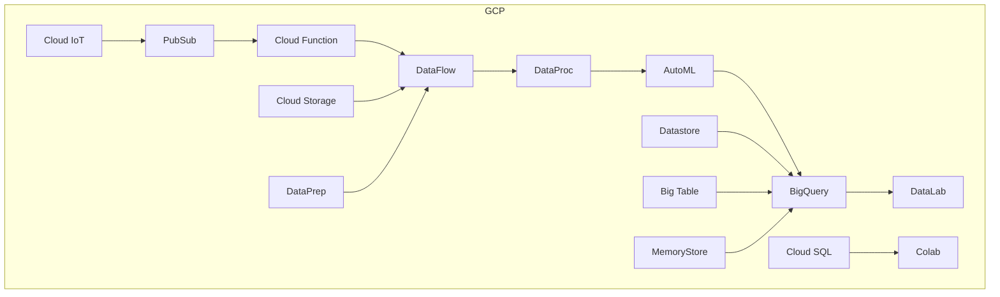
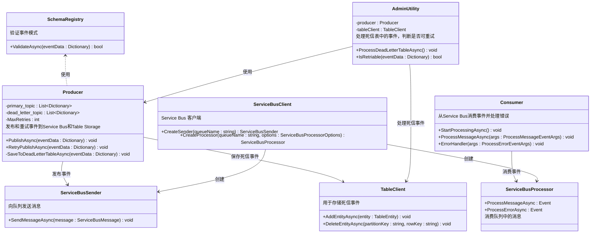

### 大数据管道（Big Data Pipeline）在AWS、Azure和GCP上的Mermaid图：







### 各部分说明

#### AWS

- **数据摄取 (Ingestion)**: AWS IoT、Kinesis Stream、Lambda、S3
- **数据湖 (Data Lake)**: S3、Glacier
- **计算 (Computation)**: Glue ETL、EMR、SageMaker、Kinesis Analytics
- **数据仓库 (Data Warehouse)**: Redshift、RDS、DynamoDB、Elasticsearch
- **展示 (Presentation)**: Athena、QuickSight

#### Azure

- **数据摄取 (Ingestion)**: IoT Hub、Event Hub、Azure Function
- **数据湖 (Data Lake)**: Azure Data Lake Store
- **计算 (Computation)**: Data Explorer、Stream Analytics、Databricks、Azure ML
- **数据仓库 (Data Warehouse)**: CosmosDB、Azure SQL、Azure Redis
- **展示 (Presentation)**: Power BI

#### GCP

- **数据摄取 (Ingestion)**: Cloud IoT、PubSub、Cloud Function
- **数据湖 (Data Lake)**: Cloud Storage
- **计算 (Computation)**: DataFlow、DataProc、AutoML
- **数据仓库 (Data Warehouse)**: BigQuery、Datastore、Big Table、MemoryStore、Cloud SQL
- **展示 (Presentation)**: Colab、DataLab

### 图示注解

该图展示了AWS、Azure和Google Cloud Platform（GCP）上的大数据管道组件，并按不同的数据处理阶段进行了分类：
- **数据摄取**: 捕获和传输数据的服务。
- **数据湖**: 用于存储大规模数据集的存储解决方案。
- **计算**: 数据处理和分析工具。
- **数据仓库**: 优化查询和分析的数据存储。
- **展示**: 可视化和商业智能工具。

这个架构适用于数据工程和大数据处理的常见用例，每个云提供商都提供了类似功能的独特工具，以满足不同的数据处理需求。

---

以下是使用C#实现的一个示例，展示在Azure上处理事件的流程。此代码使用Azure服务，如Azure Service Bus和Azure Table Storage，来模拟事件的发布、验证、错误处理和重试机制。整个代码包含事件的异步处理，以充分利用Azure的云服务。

### 项目准备

在开始前，您需要在Azure上设置以下资源：
1. **Azure Service Bus**：用于事件的发布和处理。
2. **Azure Table Storage**：用于存储未处理的事件（相当于死信队列）。
3. **Azure Function**（可选）：用于自动重试失败的事件。

### C# 示例代码

以下代码展示了如何使用C#来实现Azure上基于事件的处理流程。

#### NuGet 包

首先，您需要安装以下NuGet包：

```bash
dotnet add package Azure.Messaging.ServiceBus
dotnet add package Azure.Data.Tables
```

### C# 代码

```csharp
using System;
using System.Collections.Generic;
using System.Threading.Tasks;
using Azure.Messaging.ServiceBus;
using Azure.Data.Tables;

namespace AzureEventProcessingDemo
{
    // 模拟模式注册库，用于事件验证
    public class SchemaRegistry
    {
        public static async Task<bool> ValidateAsync(Dictionary<string, string> eventData)
        {
            await Task.Delay(100);  // 模拟异步操作
            if (eventData.ContainsKey("type") && eventData.ContainsKey("data"))
            {
                Console.WriteLine($"事件验证通过: {eventData}");
                return true;
            }
            Console.WriteLine("事件验证失败。");
            return false;
        }
    }

    // 生产者类，用于发布事件到 Azure Service Bus
    public class Producer
    {
        private readonly ServiceBusClient _serviceBusClient;
        private readonly ServiceBusSender _sender;
        private readonly TableClient _tableClient;
        private const int MaxRetries = 3;

        public Producer(string connectionString, string queueName, string tableName)
        {
            _serviceBusClient = new ServiceBusClient(connectionString);
            _sender = _serviceBusClient.CreateSender(queueName);
            _tableClient = new TableClient(connectionString, tableName);
        }

        public async Task PublishAsync(Dictionary<string, string> eventData)
        {
            Console.WriteLine($"发布事件: {eventData}");
            try
            {
                ServiceBusMessage message = new ServiceBusMessage(eventData["data"]);
                await _sender.SendMessageAsync(message);
                Console.WriteLine("事件发布成功。");
            }
            catch (Exception)
            {
                Console.WriteLine("发布失败。将事件发送到死信存储。");
                await SaveToDeadLetterTableAsync(eventData);
            }
        }

        private async Task SaveToDeadLetterTableAsync(Dictionary<string, string> eventData)
        {
            var entity = new TableEntity("DeadLetterPartition", Guid.NewGuid().ToString())
            {
                { "EventType", eventData.ContainsKey("type") ? eventData["type"] : "Unknown" },
                { "EventData", eventData.ContainsKey("data") ? eventData["data"] : "No data" }
            };
            await _tableClient.AddEntityAsync(entity);
            Console.WriteLine("事件已存入死信表格存储。");
        }

        public async Task RetryPublishAsync(Dictionary<string, string> eventData)
        {
            for (int attempt = 1; attempt <= MaxRetries; attempt++)
            {
                Console.WriteLine($"重试第 {attempt} 次发布事件: {eventData}");
                try
                {
                    ServiceBusMessage message = new ServiceBusMessage(eventData["data"]);
                    await _sender.SendMessageAsync(message);
                    Console.WriteLine("重试成功。事件已发布。");
                    return;
                }
                catch (Exception)
                {
                    Console.WriteLine("重试发布失败。");
                    await Task.Delay(1000);  // 模拟重试之间的延迟
                }
            }
            Console.WriteLine("达到最大重试次数。事件移至死信存储。");
            await SaveToDeadLetterTableAsync(eventData);
        }
    }

    // 消费者类，从 Service Bus 消费事件
    public class Consumer
    {
        private readonly ServiceBusProcessor _processor;

        public Consumer(string connectionString, string queueName)
        {
            var client = new ServiceBusClient(connectionString);
            _processor = client.CreateProcessor(queueName, new ServiceBusProcessorOptions());
            _processor.ProcessMessageAsync += ProcessMessageAsync;
            _processor.ProcessErrorAsync += ErrorHandler;
        }

        public async Task StartProcessingAsync()
        {
            await _processor.StartProcessingAsync();
        }

        private async Task ProcessMessageAsync(ProcessMessageEventArgs args)
        {
            string messageBody = args.Message.Body.ToString();
            Console.WriteLine($"消费事件: {messageBody}");
            await Task.Delay(1000);  // 模拟事件处理
            Console.WriteLine("事件处理成功。");
            await args.CompleteMessageAsync(args.Message);
        }

        private Task ErrorHandler(ProcessErrorEventArgs args)
        {
            Console.WriteLine($"事件处理错误: {args.Exception}");
            return Task.CompletedTask;
        }
    }

    // 管理工具类，用于处理死信表中的事件
    public class AdminUtility
    {
        private readonly Producer _producer;
        private readonly TableClient _tableClient;

        public AdminUtility(Producer producer, string connectionString, string tableName)
        {
            _producer = producer;
            _tableClient = new TableClient(connectionString, tableName);
        }

        public async Task ProcessDeadLetterTableAsync()
        {
            Console.WriteLine("处理死信表中的事件...");
            var entities = _tableClient.Query<TableEntity>("PartitionKey eq 'DeadLetterPartition'");
            foreach (var entity in entities)
            {
                var eventData = new Dictionary<string, string>
                {
                    { "type", entity.GetString("EventType") },
                    { "data", entity.GetString("EventData") }
                };

                if (IsRetriable(eventData))
                {
                    Console.WriteLine($"从死信表重试事件: {eventData}");
                    await _producer.RetryPublishAsync(eventData);
                    await _tableClient.DeleteEntityAsync(entity.PartitionKey, entity.RowKey);
                }
                else
                {
                    Console.WriteLine($"事件不可重试，需要人工干预: {eventData}");
                }
            }
        }

        private static bool IsRetriable(Dictionary<string, string> eventData)
        {
            // 随机决定是否可重试
            return new Random().Next(2) == 0;
        }
    }

    class Program
    {
        static async Task Main(string[] args)
        {
            string connectionString = "<Azure_ServiceBus_ConnectionString>";
            string queueName = "event-queue";
            string tableName = "deadletter";

            var primaryTopic = new List<Dictionary<string, string>>();
            var deadLetterTopic = new List<Dictionary<string, string>>();

            var producer = new Producer(connectionString, queueName, tableName);
            var consumer = new Consumer(connectionString, queueName);
            var adminUtility = new AdminUtility(producer, connectionString, tableName);

            // 模拟事件处理流程
            var events = new List<Dictionary<string, string>>
            {
                new Dictionary<string, string> { { "type", "order" }, { "data", "Order123" } },
                new Dictionary<string, string> { { "type", "payment" }, { "data", "Payment456" } },
                new Dictionary<string, string> { { "data", "不完整的事件" } }
            };

            foreach (var eventData in events)
            {
                Console.WriteLine("\n处理新事件...");
                if (await SchemaRegistry.ValidateAsync(eventData))
                {
                    await producer.PublishAsync(eventData);
                }
                else
                {
                    Console.WriteLine("事件未通过模式验证，被丢弃。");
                }
            }

            await consumer.StartProcessingAsync();
            Console.WriteLine("\n管理工具处理死信表中的事件:");
            await adminUtility.ProcessDeadLetterTableAsync();
        }
    }
}
```

### 代码说明

1. **SchemaRegistry (模式注册库)**：用于验证事件结构，确保事件符合要求。

2. **Producer (生产者)**：将事件发布到Azure Service Bus中。若发布失败，则将事件保存到Azure Table Storage的死信表中。

3. **Consumer (消费者)**：从Azure Service Bus的队列中异步消费事件，并处理消息。

4. **AdminUtility (管理工具)**：从死信表中读取失败的事件，判断是否可以重试，若可重试则调用生产者进行重试发布。

### 项目依赖

- **Azure Service Bus**：用于事件的异步发布和消费。
- **Azure Table Storage**：用于存储未成功发布的事件作为“死信队列”。
  
### 适用场景

在Azure中，这个事件处理流程适合用于分布式系统中的可靠事件传递。使用C#的 `async/await` 可以充分利用异步操作，提升性能和资源利用率。

---

以下是基于上述C#代码的Mermaid类图，用于展示在Azure上实现的事件处理流程：



### 类图说明

1. **SchemaRegistry (模式注册库)**：
   - `ValidateAsync(eventData)`：验证事件结构，确保事件符合预期的模式。

2. **Producer (生产者)**：
   - `PublishAsync(eventData)`：将事件发布到Azure Service Bus。如果发布失败，则将事件保存到Azure Table Storage的死信表中。
   - `RetryPublishAsync(eventData)`：对失败的事件进行重试发布。
   - `SaveToDeadLetterTableAsync(eventData)`：将未成功发布的事件保存到Table Storage的死信表中。

3. **Consumer (消费者)**：
   - `StartProcessingAsync()`：开始消费事件。
   - `ProcessMessageAsync(args)`：处理从Service Bus中接收到的消息。
   - `ErrorHandler(args)`：处理消费过程中发生的错误。

4. **AdminUtility (管理工具)**：
   - `ProcessDeadLetterTableAsync()`：处理死信表中的事件，判断是否可以重试。
   - `IsRetriable(eventData)`：判断事件是否可以重试发布。

5. **TableClient (表格客户端)**：
   - `AddEntityAsync(entity)`：将事件保存到Table Storage中。
   - `DeleteEntityAsync(partitionKey, rowKey)`：从Table Storage中删除已处理的事件。

6. **ServiceBusClient (Service Bus客户端)**：
   - 创建 `ServiceBusSender` 和 `ServiceBusProcessor`，分别用于发送和消费消息。

7. **ServiceBusSender (消息发送器)**：
   - `SendMessageAsync(message)`：将事件发送到Service Bus的队列中。

8. **ServiceBusProcessor (消息处理器)**：
   - `ProcessMessageAsync` 和 `ProcessErrorAsync`：用于处理和消费队列中的消息。

### 类关系

- `SchemaRegistry` 为 `Producer` 提供事件验证服务。
- `Producer` 使用 `ServiceBusSender` 来发布事件，如果发布失败，则使用 `TableClient` 将事件保存到死信表中。
- `AdminUtility` 使用 `Producer` 来重试发布事件，并使用 `TableClient` 处理死信表中的事件。
- `Consumer` 使用 `ServiceBusProcessor` 来消费事件。
- `ServiceBusClient` 可以创建 `ServiceBusSender` 和 `ServiceBusProcessor`，分别用于发送和消费消息。

此类图提供了在Azure上实现事件处理流程的关键类及其交互关系。
