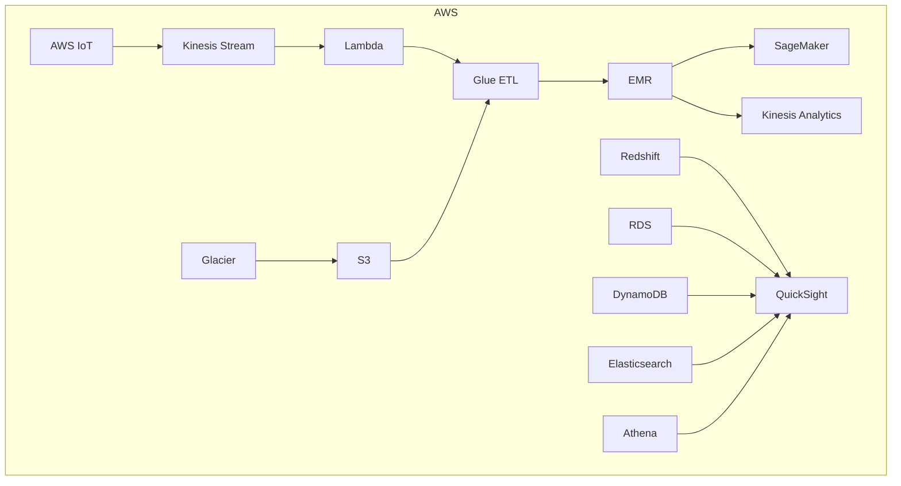
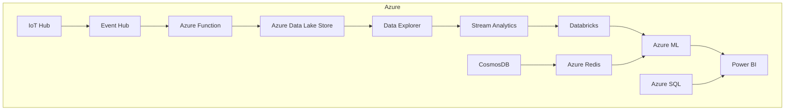
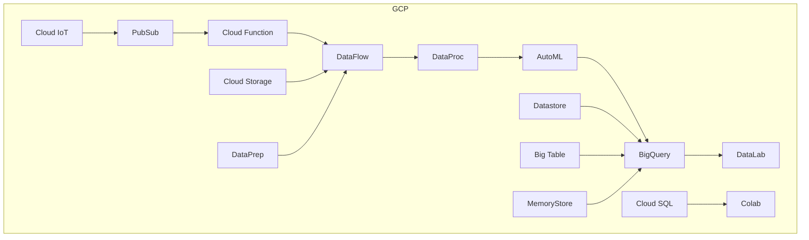
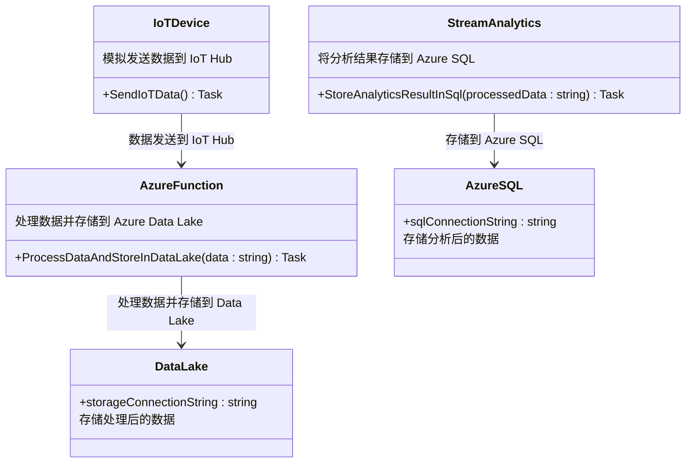

### 大数据管道（Big Data Pipeline）在AWS、Azure和GCP上的Mermaid图：







### 各部分说明

#### AWS

- **数据摄取 (Ingestion)**: AWS IoT、Kinesis Stream、Lambda、S3
- **数据湖 (Data Lake)**: S3、Glacier
- **计算 (Computation)**: Glue ETL、EMR、SageMaker、Kinesis Analytics
- **数据仓库 (Data Warehouse)**: Redshift、RDS、DynamoDB、Elasticsearch
- **展示 (Presentation)**: Athena、QuickSight

#### Azure

- **数据摄取 (Ingestion)**: IoT Hub、Event Hub、Azure Function
- **数据湖 (Data Lake)**: Azure Data Lake Store
- **计算 (Computation)**: Data Explorer、Stream Analytics、Databricks、Azure ML
- **数据仓库 (Data Warehouse)**: CosmosDB、Azure SQL、Azure Redis
- **展示 (Presentation)**: Power BI

#### GCP

- **数据摄取 (Ingestion)**: Cloud IoT、PubSub、Cloud Function
- **数据湖 (Data Lake)**: Cloud Storage
- **计算 (Computation)**: DataFlow、DataProc、AutoML
- **数据仓库 (Data Warehouse)**: BigQuery、Datastore、Big Table、MemoryStore、Cloud SQL
- **展示 (Presentation)**: Colab、DataLab

### 图示注解

该图展示了AWS、Azure和Google Cloud Platform（GCP）上的大数据管道组件，并按不同的数据处理阶段进行了分类：
- **数据摄取**: 捕获和传输数据的服务。
- **数据湖**: 用于存储大规模数据集的存储解决方案。
- **计算**: 数据处理和分析工具。
- **数据仓库**: 优化查询和分析的数据存储。
- **展示**: 可视化和商业智能工具。

这个架构适用于数据工程和大数据处理的常见用例，每个云提供商都提供了类似功能的独特工具，以满足不同的数据处理需求。

---

以下是一个简化版的Azure C#代码示例，用于演示大数据管道的处理流程。此代码将模拟如下几个步骤：

1. 数据摄取 (Ingestion)：从 **IoT Hub** 收集数据。
2. 数据处理：通过 **Azure Function** 处理数据，将其存储到 **Data Lake**。
3. 数据分析：使用 **Stream Analytics** 对数据进行实时分析，并将结果存储到 **Azure SQL**。
4. 展示：通过 **Power BI** 可视化数据（这里只是模拟）。

注意：此代码是一个简化的模拟，实际部署时需要在Azure平台上配置相关服务，如 **IoT Hub**、**Azure Function**、**Azure Data Lake**、**Stream Analytics** 和 **Azure SQL**。

```csharp
using System;
using System.Threading.Tasks;
using Microsoft.Azure.Devices.Client;
using Microsoft.Azure.Storage.Blob;
using Microsoft.Azure.Storage;
using System.Text;
using System.Data.SqlClient;

namespace AzureBigDataPipelineDemo
{
    class Program
    {
        // IoT Hub 模拟设备发送数据
        static async Task SendIoTData()
        {
            string iotHubConnectionString = "<IoT Hub 连接字符串>";
            DeviceClient deviceClient = DeviceClient.CreateFromConnectionString(iotHubConnectionString, TransportType.Mqtt);
            string message = "{\"temperature\": 22.5, \"humidity\": 55}";
            var messageBytes = new Message(Encoding.UTF8.GetBytes(message));

            Console.WriteLine("正在发送数据到 IoT Hub...");
            await deviceClient.SendEventAsync(messageBytes);
            Console.WriteLine("数据已发送。");
        }

        // Azure Function 模拟数据处理并存储到 Data Lake
        static async Task ProcessDataAndStoreInDataLake(string data)
        {
            string storageConnectionString = "<Data Lake 连接字符串>";
            CloudStorageAccount storageAccount = CloudStorageAccount.Parse(storageConnectionString);
            CloudBlobClient blobClient = storageAccount.CreateCloudBlobClient();
            CloudBlobContainer container = blobClient.GetContainerReference("datalake");
            await container.CreateIfNotExistsAsync();

            CloudBlockBlob blob = container.GetBlockBlobReference($"processed_data_{DateTime.Now.Ticks}.json");
            await blob.UploadTextAsync(data);

            Console.WriteLine("数据已处理并存储到 Azure Data Lake。");
        }

        // 模拟 Stream Analytics 将结果存储到 Azure SQL
        static async Task StoreAnalyticsResultInSql(string processedData)
        {
            string sqlConnectionString = "<Azure SQL 数据库连接字符串>";
            using (SqlConnection connection = new SqlConnection(sqlConnectionString))
            {
                await connection.OpenAsync();
                string query = "INSERT INTO AnalyticsResults (Data, ProcessedDate) VALUES (@data, @date)";
                SqlCommand command = new SqlCommand(query, connection);
                command.Parameters.AddWithValue("@data", processedData);
                command.Parameters.AddWithValue("@date", DateTime.Now);

                await command.ExecuteNonQueryAsync();
                Console.WriteLine("数据已存储到 Azure SQL。");
            }
        }

        // 主函数，运行管道流程
        static async Task Main(string[] args)
        {
            // 1. 从 IoT Hub 获取数据（模拟）
            await SendIoTData();

            // 2. 模拟从 IoT Hub 接收到数据，并调用 Azure Function 处理数据
            string receivedData = "{\"temperature\": 22.5, \"humidity\": 55}"; // 模拟接收到的数据
            await ProcessDataAndStoreInDataLake(receivedData);

            // 3. 将处理后的数据存储到 Azure SQL（模拟 Stream Analytics 的结果）
            await StoreAnalyticsResultInSql(receivedData);

            Console.WriteLine("管道流程已完成。");
        }
    }
}
```

### 代码说明

1. **数据摄取 (Ingestion)**：`SendIoTData` 方法模拟设备发送数据到 **IoT Hub**，数据格式为JSON格式的温度和湿度信息。
   
2. **数据处理**：`ProcessDataAndStoreInDataLake` 方法模拟 **Azure Function** 处理接收到的数据，并将其存储到 **Azure Data Lake**。这里通过 **Azure Blob Storage** API 实现数据存储。

3. **数据分析 (Stream Analytics)**：在此示例中，`StoreAnalyticsResultInSql` 方法模拟将分析结果存储到 **Azure SQL**。在实际应用中，可以通过 **Stream Analytics** 从 **Azure Data Lake** 或 **Event Hub** 获取数据并存储到数据库中。

4. **数据展示 (Power BI)**：虽然代码中没有直接包含Power BI，但数据存储在Azure SQL后，可以在Power BI中连接到Azure SQL数据源进行可视化分析。

### 注意事项

- **连接字符串**：此代码中的 `iotHubConnectionString`、`storageConnectionString` 和 `sqlConnectionString` 需要替换为实际的Azure服务连接字符串。
- **权限和配置**：在Azure上配置这些服务时，确保正确的权限和网络设置，允许这些服务之间的通信。
- **实际场景中的使用**：在生产环境中，可能需要更复杂的处理逻辑和错误处理机制。

### Python vs C# 的选择

- **C# 优势**：Azure的很多SDK和工具对C#的支持非常完善，C#可以很好地利用Azure的异步功能，并与Visual Studio集成，适合企业级应用和大数据管道构建。
- **Python 优势**：Python在数据处理和机器学习领域有很多库支持，适合快速开发和数据探索。对于快速原型和测试，Python可能更方便。

在 **Azure 环境**中，如果是一个 **企业级的大数据管道**项目，C#通常是更适合的选择，因为其良好的性能和Azure原生支持；而对于 **数据分析和机器学习**，Python则可能更为便捷。

---

以下是根据上述C#代码的Mermaid类图中文版本，帮助更直观地理解Azure大数据管道的类结构和关系。



### 类图说明

1. **IoTDevice (模拟设备)**：
   - `SendIoTData()`：模拟设备发送数据到 **IoT Hub**，作为数据管道的入口。

2. **AzureFunction (Azure 函数)**：
   - `ProcessDataAndStoreInDataLake(data : string)`：从 **IoT Hub** 获取数据后进行处理，将数据存储到 **Azure Data Lake**。

3. **DataLake (数据湖)**：
   - `storageConnectionString`：用于连接Azure Data Lake。
   - **存储**：处理后的数据会被存储在此，用于进一步的数据分析。

4. **StreamAnalytics (实时分析)**：
   - `StoreAnalyticsResultInSql(processedData : string)`：模拟实时分析，将结果数据存储到 **Azure SQL**，可供Power BI等工具进行数据展示。

5. **AzureSQL (SQL 数据库)**：
   - `sqlConnectionString`：用于连接 **Azure SQL** 数据库。
   - **存储**：保存来自 **Stream Analytics** 的分析数据，供后续展示使用。

### 总结

此类图展示了模拟的大数据管道中各个组件的交互关系：

- **IoTDevice** 代表数据来源（如设备），将数据发送到 **Azure Function** 进行处理。
- **Azure Function** 将数据进行预处理，并存储到 **Data Lake**。
- **Stream Analytics** 从 **Data Lake** 或其他数据源获取数据进行分析，并将分析结果存储在 **Azure SQL** 中。
- **Azure SQL** 可以作为数据的存储中心，方便后续在 **Power BI** 等工具中进行数据展示。

### 推荐

此类结构非常适合使用 **C#** 实现，特别是在Azure平台上，因为C#与Azure集成度高，能够充分利用异步功能提升性能。
