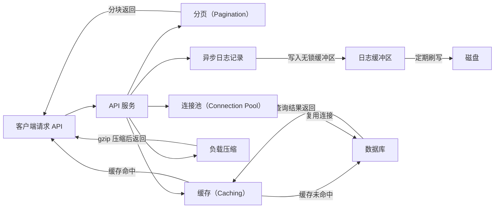
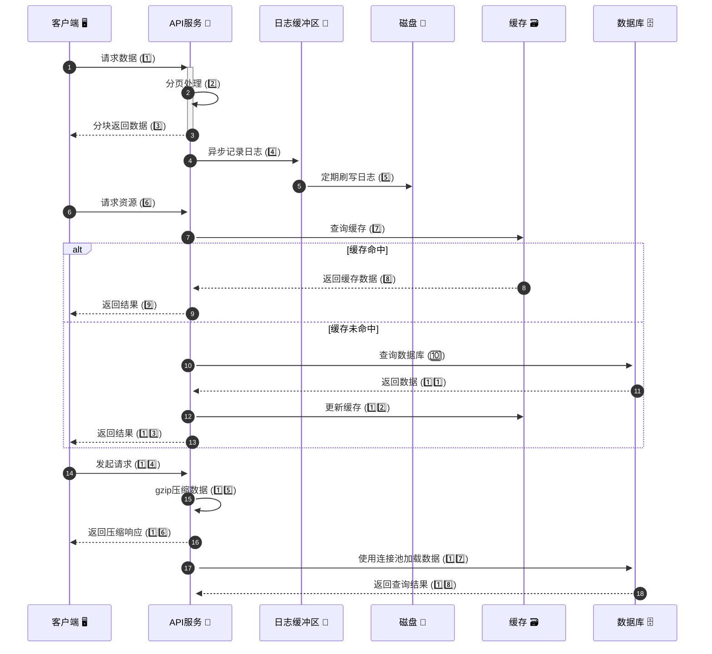
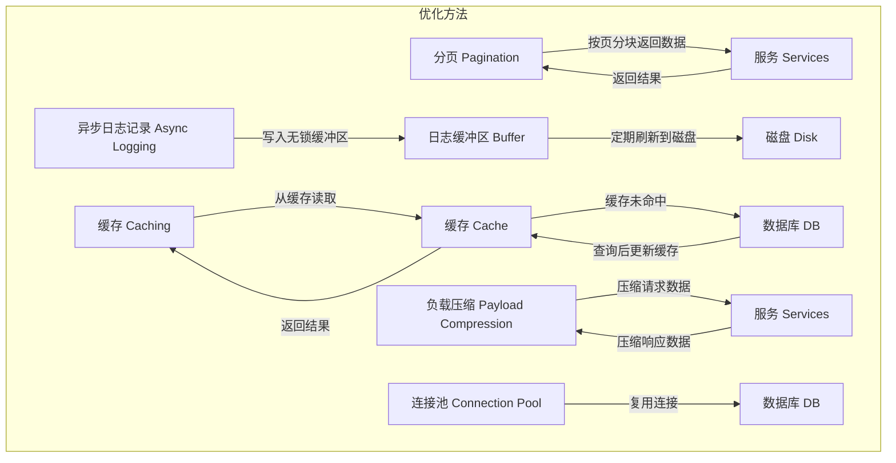

### 如何提高 API 性能？

以下是提高 API 性能的五种常见技巧及其说明：

#### 1. **分页（Pagination）**
- **原理**：当结果数据量较大时，采用分页技术将数据分块返回给客户端。
- **优势**：
  - 改善服务响应性，避免一次性返回大量数据导致延迟。
  - 客户端可以逐步加载数据，提高用户体验。
  
---

#### 2. **异步日志记录（Asynchronous Logging）**
- **原理**：同步日志记录每次都会与磁盘交互，影响性能。异步日志记录先将日志写入一个无锁缓冲区（lock-free buffer），随后定期将日志刷写到磁盘。
- **优势**：
  - 减少 I/O 操作的开销。
  - 提高系统吞吐量，尤其在高并发场景下效果显著。

---

#### 3. **缓存（Caching）**
- **原理**：将频繁访问的数据存储到缓存中，客户端首先查询缓存，如果命中缓存则直接返回结果，否则查询数据库。
- **优势**：
  - 缓存（如 Redis）基于内存存储数据，访问速度远高于数据库。
  - 减少数据库的压力，提高系统响应速度。

---

#### 4. **负载压缩（Payload Compression）**
- **原理**：对请求和响应数据进行压缩（如使用 gzip）以减少传输数据的大小。
- **优势**：
  - 显著减少网络带宽的占用。
  - 加速上传和下载，提高传输效率。

---

#### 5. **连接池（Connection Pool）**
- **原理**：与资源（如数据库）交互时，频繁打开和关闭连接会增加额外开销。通过连接池管理一组预打开的数据库连接，复用这些连接来减少延迟。
- **优势**：
  - 降低建立和释放连接的时间消耗。
  - 通过连接池管理连接生命周期，提高资源利用率。

---

### **示例图解：提高 API 性能的 5 种技巧**

---

### 总结

通过以上技巧，我们可以有效提升 API 的性能。以下是各技巧的适用场景：
1. **分页**：适用于结果数据量大的查询。
2. **异步日志**：适用于需要频繁记录日志的高并发系统。
3. **缓存**：适用于热点数据访问频繁的场景。
4. **负载压缩**：适用于数据传输量大的系统。
5. **连接池**：适用于频繁与数据库交互的服务。

---

Here’s the sequence diagram for the API performance improvement flow based on the steps provided, including flow numbers and emojis for clarity:

### Explanation:
1. **Flow Numbers**:
   - Each step is numbered for clear understanding of the flow.
   - Numbers represent the sequential progression of operations.
   
2. **Icons (Emojis)**:
   - Added relevant emojis for components like 🖥️ (client), 🔧 (API service), 💾 (buffer), 📀 (disk), 🗃️ (cache), and 🗄️ (database) for visual clarity.

3. **Sections**:
   - Divided the sequence into distinct sections for each optimization technique:
     - Pagination (steps 1️⃣–3️⃣)
     - Asynchronous Logging (steps 4️⃣–5️⃣)
     - Caching (steps 6️⃣–1️⃣3️⃣)
     - Payload Compression (steps 1️⃣4️⃣–1️⃣6️⃣)
     - Connection Pool (steps 1️⃣7️⃣–1️⃣8️⃣)

### Usage:
This sequence diagram outlines the end-to-end flow of optimizing API performance with clearly defined roles and processes.

---

API 性能的示例说明图，包括分页、异步日志、缓存、负载压缩和连接池五种优化方法：

1. **分页 (Pagination)**：
   - 数据按页分块返回给客户端，避免一次性加载过多数据。
   - 提高服务响应性。

2. **异步日志记录 (Async Logging)**：
   - 日志写入无锁缓冲区后立即返回。
   - 定期将日志刷新到磁盘，降低 I/O 开销。

3. **缓存 (Caching)**：
   - 将热点数据存储在内存缓存（如 Redis）中，优先从缓存读取数据。
   - 如果缓存未命中，再从数据库查询并更新缓存。

4. **负载压缩 (Payload Compression)**：
   - 压缩请求和响应数据，减少网络传输的数据量。
   - 提高上传和下载速度。

5. **连接池 (Connection Pool)**：
   - 使用连接池管理数据库连接生命周期。
   - 减少频繁建立和关闭连接的开销。

通过以上优化方法，能够显著提升 API 性能，降低资源消耗。
