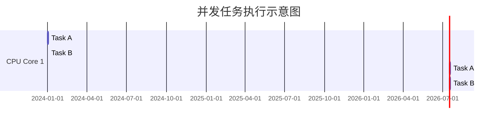
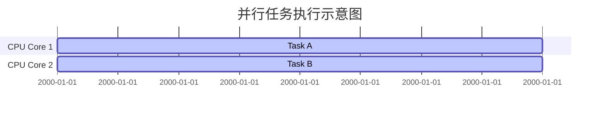
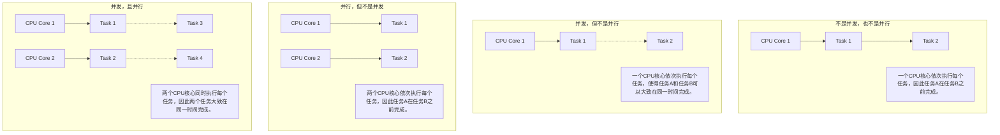

### 并行 (Parallelism) vs 并发 (Concurrency)

并行和并发是计算机科学中两个重要的概念，经常用于描述多任务执行的方式。虽然它们有一定的联系，但在实际实现和应用中存在显著区别。

---

#### **核心区别：**

| 特点           | 并行 (Parallelism)                                          | 并发 (Concurrency)                                     |
|----------------|------------------------------------------------------------|-------------------------------------------------------|
| **定义**       | 多个任务**同时**执行，利用多核 CPU 提高效率。                | 多个任务**交替**执行，在同一时间段内“看起来”同时运行。 |
| **任务分配**   | 不同的任务分配到不同的 CPU 核心，同时运行。                  | 任务在单个或多个 CPU 核心上快速切换。                 |
| **硬件依赖**   | 强依赖多核或多处理器硬件支持。                               | 不依赖多核硬件，只需要支持多任务调度的系统。           |
| **目标**       | 提高处理能力，缩短运行时间。                                 | 提高任务切换效率，增强响应能力。                      |
| **示例**       | 同时运行多个科学计算程序。                                   | 在浏览器中同时加载多个网页或任务调度。                |

---

### **理解概念**

#### 1. **并行 (Parallelism)**

- **特点**：多个任务真正同时执行。
- **实现方式**：需要多核 CPU，任务被分配到不同的核心上。
- **场景**：适用于 CPU 密集型任务，如大数据计算、科学运算。
- **形象比喻**：假设有两个人（两个 CPU 核心）同时抬两块石头，每个人负责一块。

#### 2. **并发 (Concurrency)**

- **特点**：多个任务交替执行，看起来在同时运行，但实际上是快速切换。
- **实现方式**：通过操作系统的时间分片技术。
- **场景**：适用于 I/O 密集型任务，如网络请求、文件读取。
- **形象比喻**：一个人（单核 CPU）抬两块石头，但快速切换抬石头的顺序，让别人以为在同时完成。

---

### **对比图解：并行 vs 并发**

#### 图 1: 并发 (Concurrency)

- **说明**：
  - 单核 CPU 通过时间片切换执行任务 A 和任务 B。
  - 在一个时间点上，只有一个任务在运行。

---

#### 图 2: 并行 (Parallelism)

- **说明**：
  - 两个 CPU 核心分别执行任务 A 和任务 B。
  - 两个任务真正同时运行，不存在切换开销。

---

### **应用场景**

| 场景                | 并行                                      | 并发                                     |
|---------------------|------------------------------------------|-----------------------------------------|
| **科学计算**         | 是                                         | 否                                      |
| **Web 服务器**       | 是                                         | 是                                      |
| **文件下载和处理**   | 否                                         | 是                                      |
| **高性能计算**       | 是                                         | 否                                      |

---

### **总结 (Key Takeaways)**

1. **并行是硬件层面的“同时”，并发是逻辑层面的“同时”。**
2. 并行可以视为更高效的并发，但需要硬件支持。
3. 理解场景和需求，选择合适的模式优化系统性能。

---

如果需要详细图解或代码示例，请进一步说明需求！

---

### Diagram Description in Chinese

#### 1. **不是并发，也不是并行**
   - **描述**：一个 CPU 核心依次执行每个任务，因此任务 A 在任务 B 之前完成。
   - **CPU 资源**：单核 CPU。

#### 2. **并发，但不是并行**
   - **描述**：一个 CPU 核心依次执行任务，但时间片交替，使得任务 A 和任务 B 看起来在同一时间完成。
   - **CPU 资源**：单核 CPU。

#### 3. **并行，但不是并发**
   - **描述**：两个 CPU 核心独立执行任务，每个任务的顺序是固定的。
   - **CPU 资源**：多核 CPU。

#### 4. **并发，且并行**
   - **描述**：两个 CPU 核心同时处理任务，并且时间片交替调度使任务完成效率最高。
   - **CPU 资源**：多核 CPU。
