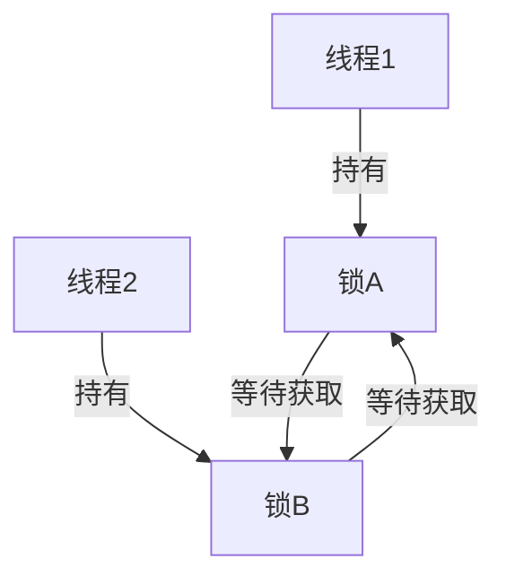

### 操作系统之死锁：关键概念及解决方案

#### 死锁的定义
当多个进程在获取共享资源时，彼此互相等待，导致系统进入一个无法前进的状态，就发生了**死锁**。这些进程无法释放占有的资源，系统陷入无尽的等待。

---

#### 产生死锁的四个必要条件
要发生死锁，必须满足以下四个条件：

1. **互斥条件**  
   共享资源（如打印机、文件等）只能由一个线程独占，其他线程无法访问。
   
2. **占用且等待条件**  
   线程已经持有一个资源，同时还在等待其他线程占有的资源。
   
3. **不可抢占条件**  
   资源不能被强行从线程中抢夺，线程必须主动释放资源。
   
4. **循环等待条件**  
   存在一个资源循环等待链，即线程1等待线程2占有的资源，线程2等待线程3的资源，以此类推，形成闭环。

---

#### 示例场景

在此情景下：
- 线程1占有锁A并等待锁B。
- 线程2占有锁B并等待锁A。
- 两个线程互相等待，形成死锁。

---

#### 预防和避免死锁的策略

1. **破坏产生死锁的必要条件之一**：
   - **破坏占用且等待条件**：在请求新资源之前，线程必须释放已经持有的资源。
   - **破坏循环等待条件**：通过为资源分配一个固定的顺序，线程只能按顺序请求资源。

2. **具体方法**：
   - **一次封锁法**：线程一次性请求它需要的所有资源。
   - **顺序分配法**：所有资源按固定顺序编号，线程必须按序请求资源。
   - **银行家算法**：基于线程需要的资源数量，动态判断是否进入安全状态。
   - **引入超时机制**：设置资源请求的最大等待时间，超时后释放资源。

---

#### 解除死锁的策略

1. **剥夺资源**：  
   从某些线程中强制剥夺资源并分配给其他线程，以解除死锁状态。

2. **撤销进程**：  
   强制终止死锁线程并释放资源。

---

#### 总结
理解和预防死锁是操作系统设计的核心问题之一。通过分析系统资源的使用情况和线程行为，可以有效减少和避免死锁问题。

---

需要进一步的代码或图解示例吗？
