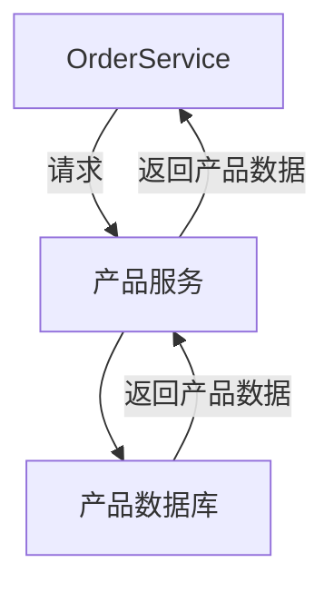
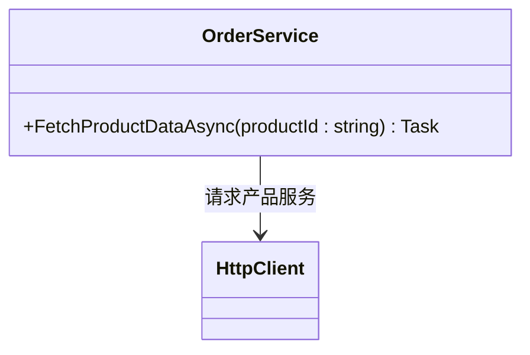
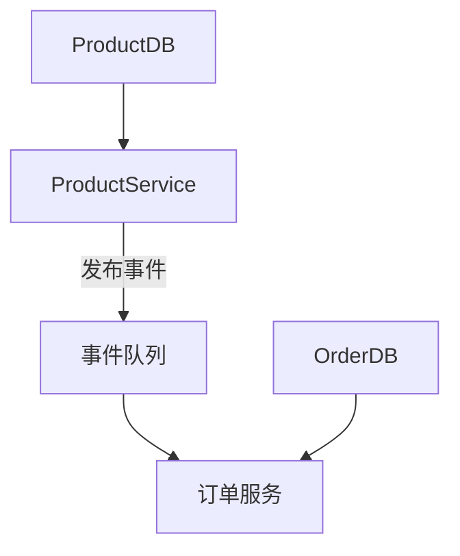
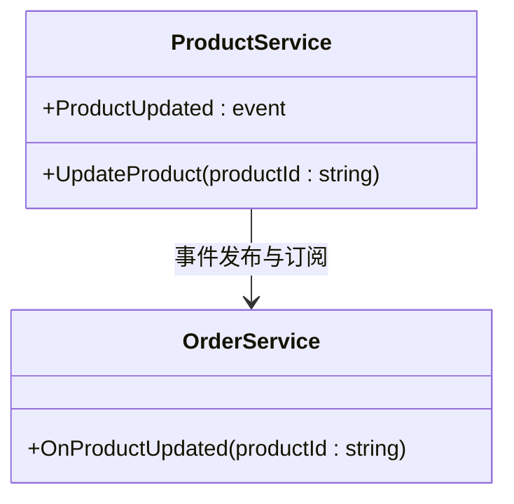
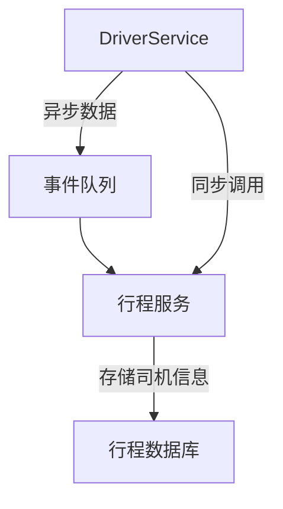
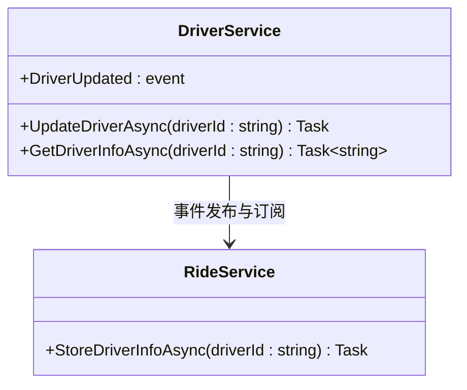

### 数据共享模式在微服务架构中的不同方式

以下是数据共享模式在微服务架构中的不同方式的详细解释，包括同步、异步和混合方法的流程图、C#代码示例和类图。

---

### 1. Synchronous Data Sharing（同步数据共享）

**描述**：  
同步数据共享涉及服务之间的实时通信，通常通过REST或gRPC等协议实现。例如，订单服务可以通过直接请求产品服务获取最新的产品信息。

#### Mermaid流程图



#### C#代码示例

```csharp
using System;
using System.Net.Http;
using System.Threading.Tasks;

public class OrderService
{
    private readonly HttpClient _httpClient = new HttpClient();

    public async Task FetchProductDataAsync(string productId)
    {
        string url = $"https://product-service/api/products/{productId}";
        var response = await _httpClient.GetAsync(url);
        string productData = await response.Content.ReadAsStringAsync();

        Console.WriteLine($"Fetched product data for product ID {productId}: {productData}");
    }
}

public class Program
{
    public static async Task Main()
    {
        var orderService = new OrderService();
        await orderService.FetchProductDataAsync("123");
    }
}
```

#### Mermaid类图



---

### 2. Asynchronous Data Sharing（异步数据共享）

**描述**：  
异步数据共享依赖于事件机制，使服务之间的通信非阻塞。事件发布后，数据将在各个服务中保持最终一致性。

#### Mermaid流程图



#### C#代码示例

```csharp
using System;
using System.Threading.Tasks;

public class ProductService
{
    public event Action<string> ProductUpdated;

    public void UpdateProduct(string productId)
    {
        Console.WriteLine($"产品 {productId} 已更新");
        ProductUpdated?.Invoke(productId); // 发布事件
    }
}

public class OrderService
{
    public void OnProductUpdated(string productId)
    {
        Console.WriteLine($"订单服务接收到产品更新事件，产品ID: {productId}");
        // 更新本地数据
    }
}

public class Program
{
    public static void Main()
    {
        var productService = new ProductService();
        var orderService = new OrderService();

        productService.ProductUpdated += orderService.OnProductUpdated;
        
        productService.UpdateProduct("123");
    }
}
```

#### Mermaid类图



---

### 3. Hybrid Approach（混合方法）

**描述**：  
混合数据共享模式结合了同步和异步方法。通常用于复杂场景，其中部分数据需要同步检索，而其他部分数据则可以异步更新。例如，在打车应用中，司机和用户的实时状态可以通过异步方式共享，但驱动信息可以通过同步调用获取。

#### Mermaid流程图



#### C#代码示例

```csharp
using System;
using System.Net.Http;
using System.Threading.Tasks;

public class DriverService
{
    public event Action<string> DriverUpdated;

    public async Task UpdateDriverAsync(string driverId)
    {
        Console.WriteLine($"司机 {driverId} 状态更新");
        DriverUpdated?.Invoke(driverId); // 异步事件发布
    }

    public async Task<string> GetDriverInfoAsync(string driverId)
    {
        string url = $"https://driver-service/api/drivers/{driverId}";
        using HttpClient client = new HttpClient();
        HttpResponseMessage response = await client.GetAsync(url);
        return await response.Content.ReadAsStringAsync();
    }
}

public class RideService
{
    public async Task StoreDriverInfoAsync(string driverId)
    {
        var driverService = new DriverService();
        string driverInfo = await driverService.GetDriverInfoAsync(driverId);
        Console.WriteLine($"行程服务存储司机信息: {driverInfo}");
    }
}

public class Program
{
    public static async Task Main()
    {
        var driverService = new DriverService();
        var rideService = new RideService();

        driverService.DriverUpdated += async (driverId) => await rideService.StoreDriverInfoAsync(driverId);

        await driverService.UpdateDriverAsync("123");
    }
}
```

#### Mermaid类图



---

### 4. Trade-offs and Decisions（权衡和决策）

**描述**：  
在选择数据共享方式时，需要根据一致性要求、性能、可扩展性和系统需求来进行权衡。以下因素通常需要考虑：
- **一致性**：强一致性与最终一致性之间的选择。
- **性能**：延迟、吞吐量和资源利用率。
- **可扩展性**：水平扩展性和数据量的处理能力。

#### 总结

在微服务数据共享中，以下模式各有适用场景：

- **同步数据共享**：适用于强一致性需求，但会增加系统的耦合性。
- **异步数据共享**：适合最终一致性要求，适用于较松散耦合的系统。
- **混合方法**：适用于需要不同一致性要求的数据类型的场景，可以灵活调整。

根据需求选择合适的模式，可以在保持系统一致性的同时，优化系统的性能和扩展性。
