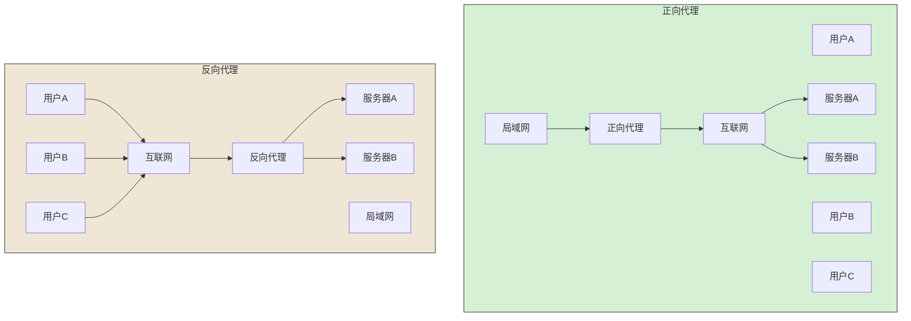

### 正向代理 vs 反向代理

```mermaid
graph TD
    subgraph 正向代理
        用户A[用户A]
        用户B[用户B]
        用户C[用户C]
        局域网 --> 正向代理服务器[正向代理]
        正向代理服务器 --> 互联网A[互联网]
        互联网A --> 服务器A[服务器A]
        互联网A --> 服务器B[服务器B]
    end

    subgraph 反向代理
        用户A2[用户A]
        用户B2[用户B]
        用户C2[用户C]
        互联网B[互联网]
        反向代理服务器[反向代理]
        局域网2[局域网]

        用户A2 --> 互联网B
        用户B2 --> 互联网B
        用户C2 --> 互联网B
        互联网B --> 反向代理服务器
        反向代理服务器 --> 服务器A2[服务器A]
        反向代理服务器 --> 服务器B2[服务器B]
    end

    style 正向代理 fill:#d6f0d6,stroke:#333,stroke-width:1px;
    style 反向代理 fill:#f0e6d6,stroke:#333,stroke-width:1px;
```

### 说明

- **正向代理**：用户通过正向代理服务器连接到互联网，正向代理服务器将请求转发到目标服务器（服务器A或服务器B）。
- **反向代理**：用户请求通过互联网到达反向代理服务器，反向代理服务器将请求分配到后端服务器（服务器A或服务器B）。
