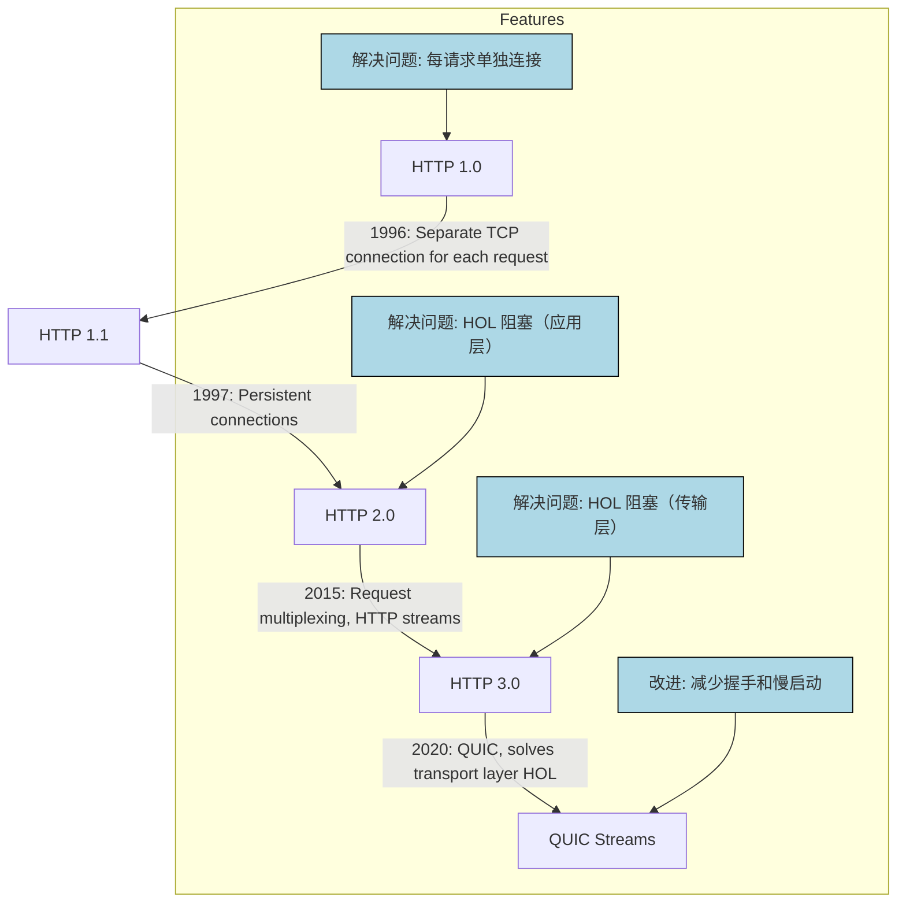
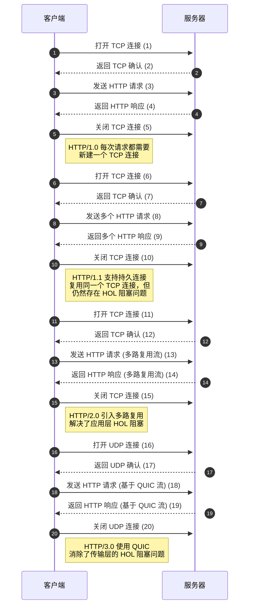

### HTTP 1.0 -> HTTP 1.1 -> HTTP 2.0 -> HTTP 3.0 (QUIC)：每代 HTTP 解决了什么问题？

 

#### **HTTP 1.0**
- **发布时间**：1996 年。
- **问题**：每次向同一服务器发送请求时，都需要建立一个单独的 TCP 连接。
- **限制**：
  - 建立和关闭 TCP 连接的开销大。
  - 性能瓶颈显著，特别是在需要频繁发送请求时。

 

#### **HTTP 1.1**
- **发布时间**：1997 年。
- **改进**：
  - 引入了**持久连接（Persistent Connection）**，同一个 TCP 连接可以复用多个 HTTP 请求。
- **问题**：
  - **HOL 阻塞（Head-of-Line Blocking）**仍未解决：
    - 浏览器中允许的并行请求数有限（通常为 6-8 个）。
    - 超过并行请求数的其他请求需要等待前面的请求完成。

 

#### **HTTP 2.0**
- **发布时间**：2015 年。
- **改进**：
  - 引入了**请求多路复用（Request Multiplexing）**：
    - 允许在同一个 TCP 连接上同时发送多个 HTTP 请求。
    - 消除了应用层的 HOL 阻塞问题。
  - **HTTP 流（HTTP Streams）**：
    - 将 HTTP 交换抽象为独立的流，每个流可以独立传输，不需要按照顺序发送。
- **问题**：
  - 由于仍基于 TCP，传输层的 HOL 阻塞问题依然存在。

 

#### **HTTP 3.0（QUIC）**
- **发布时间**：2020 年（草案）。
- **改进**：
  - 使用 **QUIC** 替代 TCP 作为底层传输协议：
    - QUIC 基于 **UDP**，解决了传输层的 HOL 阻塞问题。
    - QUIC 流（QUIC Streams）成为传输层的核心概念。
- **特性**：
  - **流独立性**：QUIC 流共享同一个 QUIC 连接，且彼此独立。某一流的丢包不会影响其他流。
  - **减少握手和慢启动**：创建新流无需额外的握手过程。
 

以下是基于上述图片用中文描述 HTTP 各代协议的关键特点及其改进的 Mermaid 时序图，带有流程编号：

### 说明：
1. **HTTP/1.0**：
   - 每次请求都需要建立一个新的 TCP 连接。
   - 效率低下，特别是高并发场景。

2. **HTTP/1.1**：
   - 支持持久连接（Persistent Connection），可以在一个 TCP 连接中处理多个请求和响应。
   - 解决了频繁建立连接的问题，但仍然存在传输层的 HOL 阻塞。

3. **HTTP/2.0**：
   - 引入了多路复用，通过 HTTP 流的形式实现应用层的并发请求。
   - 消除了应用层的 HOL 阻塞，但传输层的 HOL 阻塞问题依然存在。

4. **HTTP/3.0**：
   - 使用基于 UDP 的 QUIC 协议。
   - 实现流独立性，彻底解决了传输层的 HOL 阻塞。

通过时序图展示，各代协议的改进和优化逐步解决了性能问题，使得网络通信效率更高。

### **改进点总结**
1. **HTTP 1.0**：
   - 逐次请求需重复建立 TCP 连接，效率低。
2. **HTTP 1.1**：
   - 引入持久连接，解决多次连接问题，但 HOL 阻塞未解决。
3. **HTTP 2.0**：
   - 通过多路复用，解决应用层 HOL 阻塞。
4. **HTTP 3.0（QUIC）**：
   - 改用 UDP 和 QUIC，彻底解决传输层 HOL 阻塞。

---

