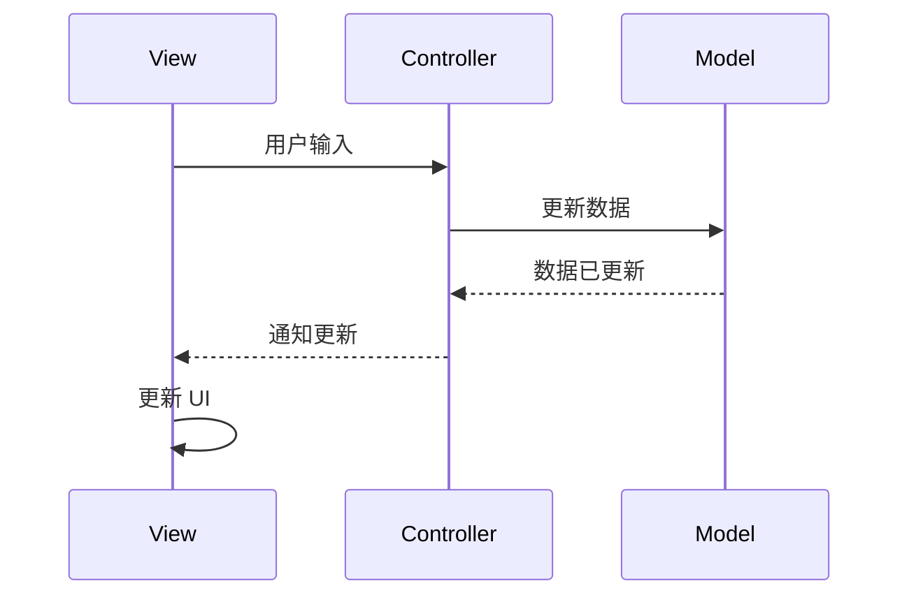
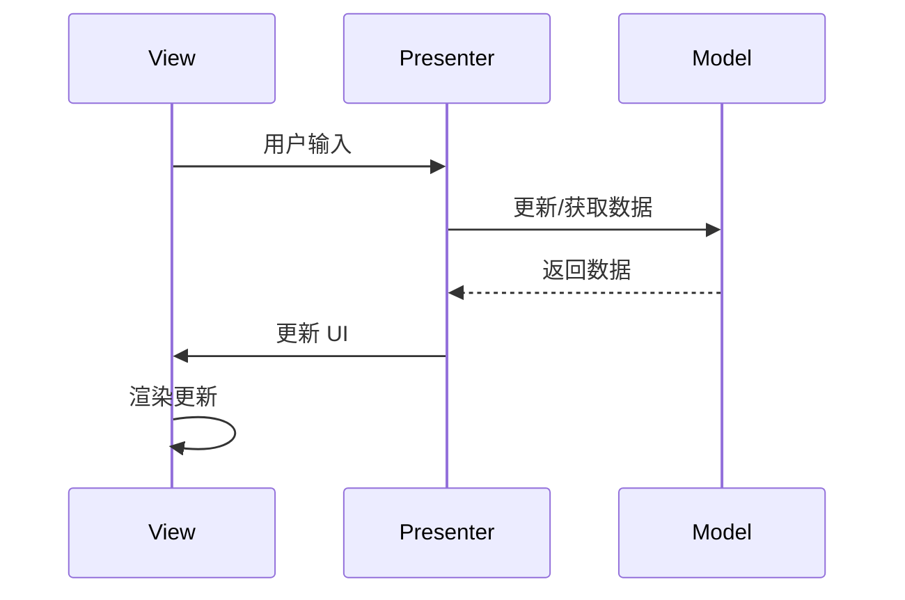
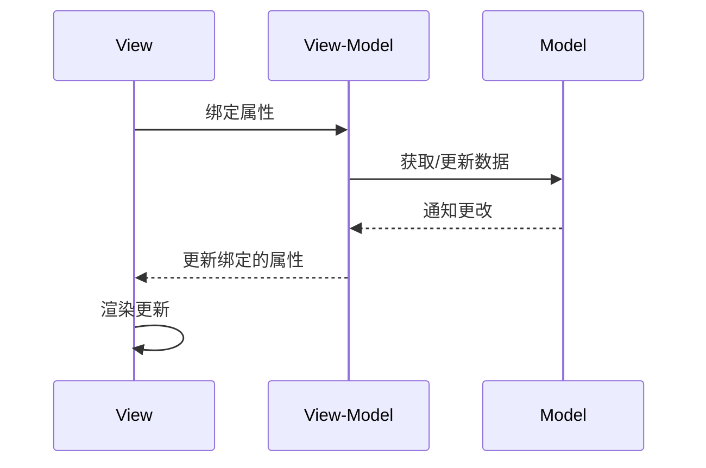
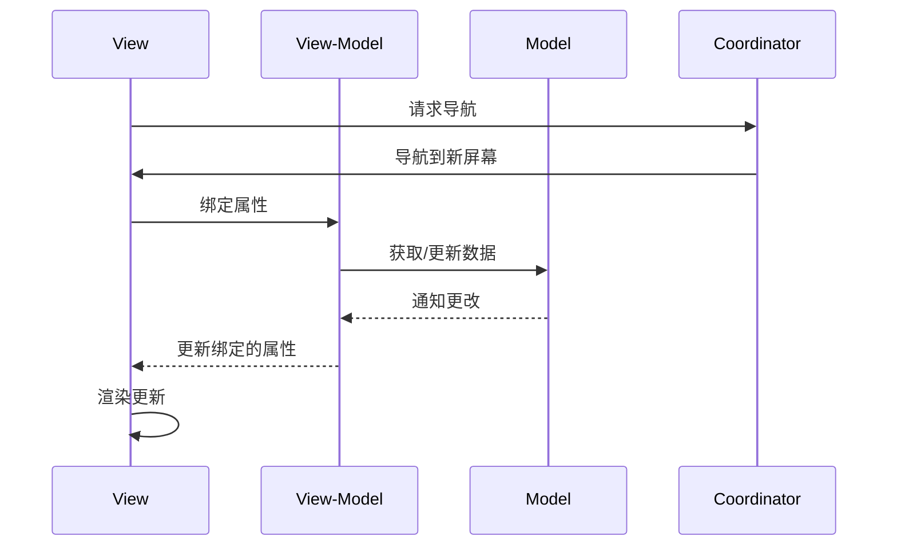
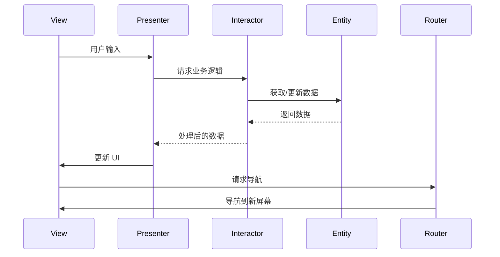

### **理解架构模式：MVC、MVP、MVVM、MVVM-C 和 VIPER**

在现代应用开发中，架构模式是管理代码复杂性、增强可扩展性和提高可维护性的关键解决方案。像 **MVC**、**MVP**、**MVVM**、**MVVM-C** 和 **VIPER** 这些模式已经成为 iOS 和 Android 开发的标准选择。以下是每种架构模式的详细解析，包括其组成部分、工作原理以及 **Mermaid 时序图** 展示的交互流程。

---

### **1. 模型-视图-控制器 (MVC)**

**组成部分**：
- **模型 (Model)**：负责管理业务数据和逻辑。
- **视图 (View)**：负责显示内容和处理用户输入。
- **控制器 (Controller)**：在视图和模型之间充当中介。

**工作原理**：
1. **视图** 将用户输入传递给 **控制器**。
2. **控制器** 处理输入并更新 **模型**。
3. **模型** 通知 **视图** 数据已更改。
4. **视图** 更新 UI。

**Mermaid 时序图**：

---

### **2. 模型-视图-展示器 (MVP)**

**组成部分**：
- **模型 (Model)**：负责管理业务数据和逻辑。
- **视图 (View)**：仅负责 UI 渲染和用户交互。
- **展示器 (Presenter)**：作为中介处理所有业务逻辑，并更新视图。

**工作原理**：
1. **视图** 将用户输入发送给 **展示器**。
2. **展示器** 更新 **模型** 或从中获取数据。
3. **展示器** 将处理后的数据更新到 **视图**。

**Mermaid 时序图**：

---

### **3. 模型-视图-视图模型 (MVVM)**

**组成部分**：
- **模型 (Model)**：负责管理业务数据和逻辑。
- **视图 (View)**：绑定到 **视图模型** 并显示数据。
- **视图模型 (View-Model)**：作为模型与视图之间的桥梁，提供数据和命令。

**工作原理**：
1. **视图** 绑定到 **视图模型** 的属性。
2. **视图模型** 更新 **模型** 或从中获取数据。
3. **模型** 的更改通过 **视图模型** 自动更新到 **视图**。

**Mermaid 时序图**：

---

### **4. 模型-视图-视图模型-协调器 (MVVM-C)**

**组成部分**：
- **模型 (Model)**：与 MVVM 相同。
- **视图 (View)**：与 MVVM 相同。
- **视图模型 (View-Model)**：与 MVVM 相同，但不负责导航逻辑。
- **协调器 (Coordinator)**：负责导航和屏幕切换。

**工作原理**：
1. **协调器** 处理导航并将控制权交给 **视图模型**。
2. **视图** 绑定到 **视图模型** 获取数据。
3. **视图模型** 与 **模型** 交互以获取或更新数据。
4. **导航事件** 由 **协调器** 管理。

**Mermaid 时序图**：

---

### **5. 视图-交互器-展示器-实体-路由器 (VIPER)**

**组成部分**：
- **视图 (View)**：显示 UI 并处理用户输入。
- **交互器 (Interactor)**：负责业务逻辑并与 **实体** 交互。
- **展示器 (Presenter)**：连接 **视图** 和 **交互器**。
- **实体 (Entity)**：数据层，表示业务模型。
- **路由器 (Router)**：管理导航和路由。

**工作原理**：
1. **视图** 将用户输入传递给 **展示器**。
2. **展示器** 将业务逻辑委派给 **交互器**。
3. **交互器** 从 **实体** 中检索或更新数据。
4. **展示器** 使用数据更新 **视图**。
5. **路由器** 处理屏幕间的导航。

**Mermaid 时序图**：

---

### **总结**

架构模式如 **MVC**、**MVP**、**MVVM**、**MVVM-C** 和 **VIPER** 提供了不同程度的模块化和关注点分离：

- **MVC**：简单直观，适合小型应用。
- **MVP**：更好的关注点分离，但展示器可能变得复杂。
- **MVVM**：简化数据绑定，适合动态数据更新的应用。
- **MVVM-C**：添加导航逻辑，适合有复杂导航流程的应用。
- **VIPER**：高度模块化，适合大型企业级应用。

根据应用的复杂性、团队经验以及维护需求选择合适的架构模式，可以设计出更高效、可扩展和易于维护的应用程序。通过这些模式的时序图，可以更清晰地理解它们的工作流程和各个组件之间的交互。
