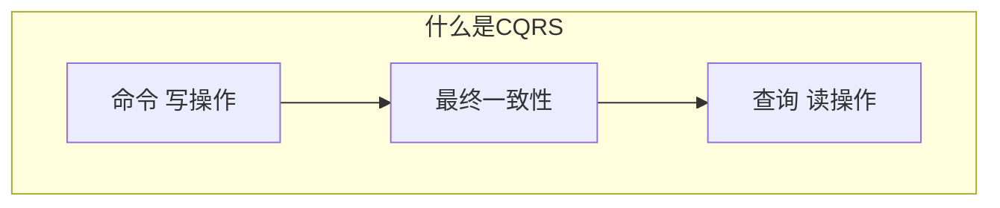
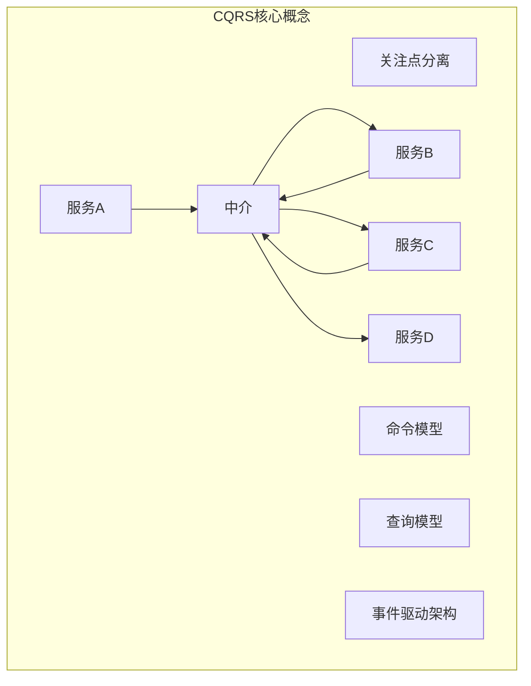
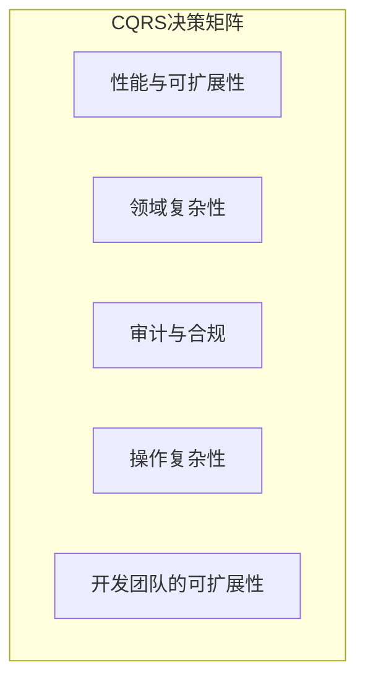
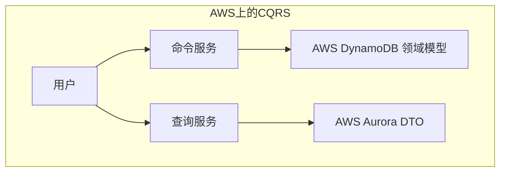
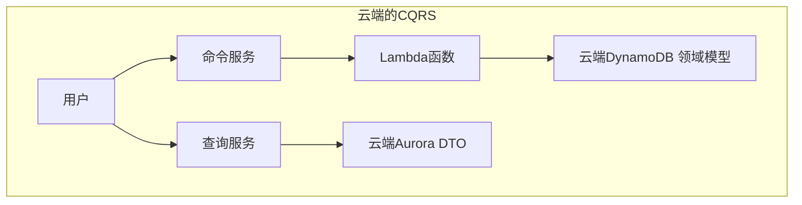
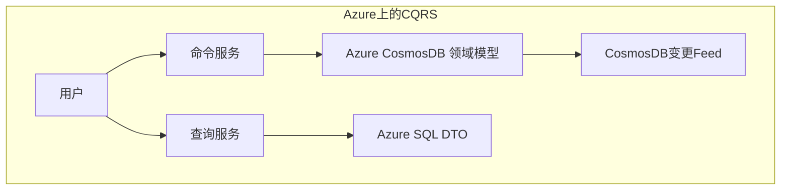
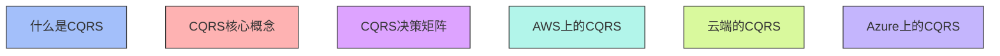

### 用于描述命令查询职责分离 (CQRS) 的关键概念：

### 各部分说明

1. **什么是CQRS**:
   - CQRS 是一种架构模式，将数据的写操作（命令）和读操作（查询）分离，确保关注点分离和性能优化。
   - 命令服务负责写操作，查询服务负责读操作，两者通过最终一致性保持数据同步。

2. **CQRS核心概念**:
   - 包括关注点分离、命令模型、查询模型、事件驱动架构等关键概念。事件驱动架构通过中介来处理服务A、B、C和D之间的通信，增强系统的扩展性和可维护性。

3. **CQRS决策矩阵**:
   - 包括性能与可扩展性、领域复杂性、审计与合规、操作复杂性、以及开发团队的可扩展性，用于评估在特定场景中是否适合采用CQRS。

4. **AWS上的CQRS**:
   - 使用Amazon DynamoDB作为领域模型的存储，Amazon Aurora作为DTO数据的存储，并通过Lambda函数实现命令和查询服务的分离。

5. **云端的CQRS**:
   - 类似AWS架构，通过Lambda函数和Amazon DynamoDB实现命令和查询服务的分离，适合于分布式环境下的CQRS实现。

6. **Azure上的CQRS**:
   - 使用Azure CosmosDB和Azure SQL分别存储领域模型和DTO数据，同时使用CosmosDB的变更Feed来处理数据更新。

### 注解

展示了CQRS架构的各个方面，包括核心概念、决策矩阵以及在AWS、云端和Azure上的典型实现。CQRS模式有助于应用程序优化性能、可扩展性和数据管理。
